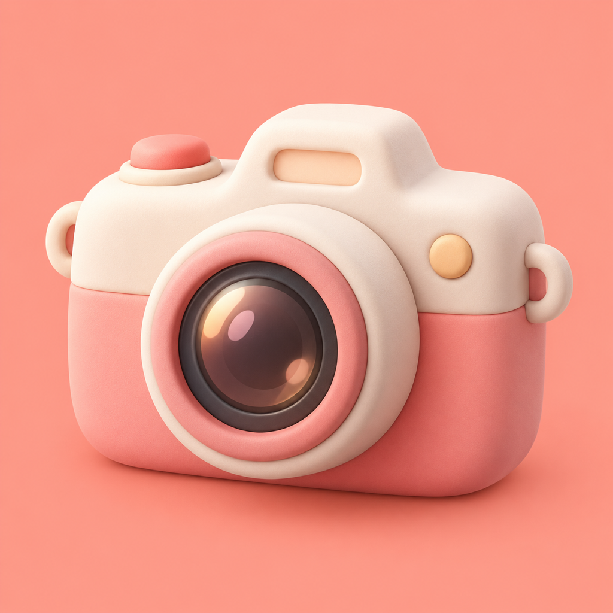
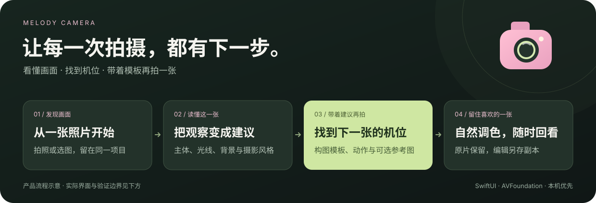
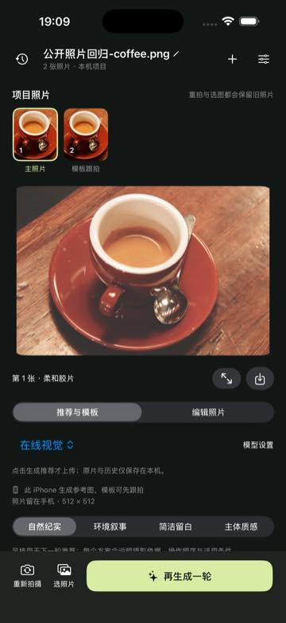
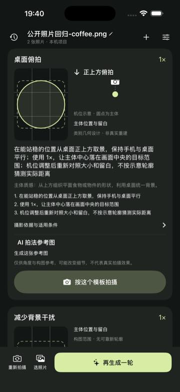
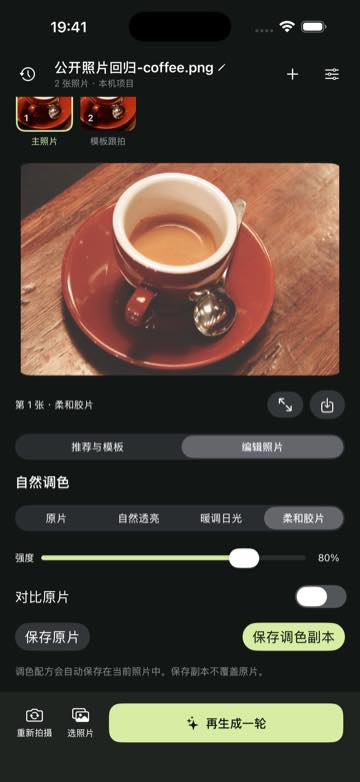
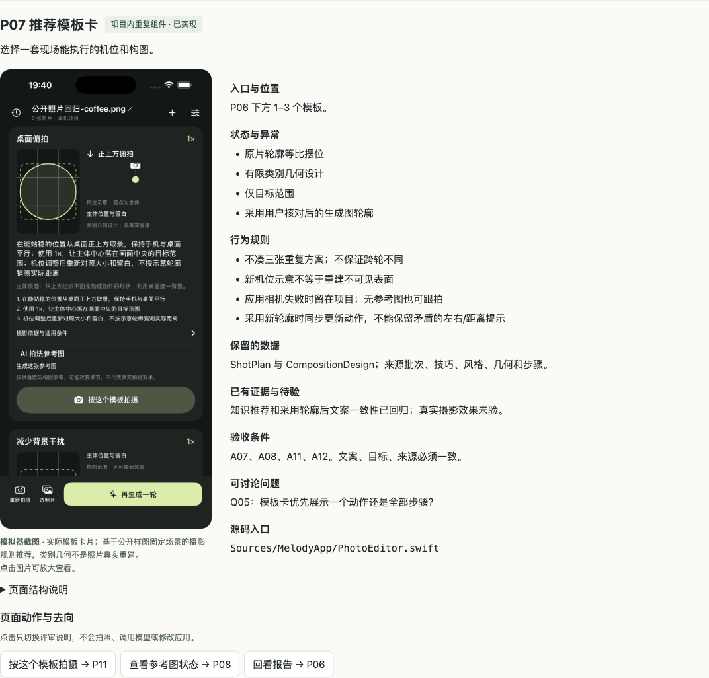

<p align="center">
  
</p>

<h1 align="center">Melody 相机</h1>

<p align="center"><strong>把喜欢的人，拍成喜欢的样子。</strong></p>
<p align="center">中文 iOS 拍摄陪伴 · 摄影知识推荐 · 手机本地参考图 · 原片始终保留</p>
<p align="center">
  <a href="#界面预览">界面预览</a> ·
  <a href="#产品原型与流程">产品原型</a> ·
  <a href="#开始体验">开始体验</a> ·
  <a href="#模型与个人配置">模型配置</a> ·
  <a href="docs/README.md">项目知识库</a>
</p>



拍下一张照片，得到具体的机位和构图建议，再带着模板继续拍。Melody 把**原片、历次推荐、跟拍照片与调色配方**放在同一个项目里，让拍摄成为可以回看、可以继续的过程。

采用 **SwiftUI + AVFoundation + Apple Vision**；支持在线视觉分析与本机 Gemma，参考图由 iPhone 内的 Draw Things / Qwen Edit 生成。项目持续开发中，功能实现与实际验收范围分别记录。

## 界面预览

| 从照片开始 | 带着模板再拍 | 自然调色，保留原片 |
|:---:|:---:|:---:|
| <a href="docs/prd/assets/p03-project.png"></a> | <a href="docs/prd/assets/p07-templates.png"></a> | <a href="docs/prd/assets/p12-edit.png"></a> |
| 多照片、多轮推荐留在同一项目 | 查看目标位置、拍摄动作与摄影依据 | 每张照片保留自己的编辑配方 |

以上为 **iOS 模拟器实际截图**，使用公开咖啡样图和明确标注的固定测试数据；不代表真实模型识别、真机拍照或摄影效果验收。点击图片查看原始截图。咖啡照片作者 Rachel Michetti，CC0；完整来源见 [图片说明](docs/prd/assets/README.md)。

## 现在可以体验什么

- **进入即取景**：iPhone 默认启动后摄；拍照或从系统相册选图后进入项目，选模板可返回取景继续跟拍。
- **建议能照着做**：结合照片观察与摄影知识，给出构图目标、推荐倍率、机位、动作和依据；提供自然纪实、环境叙事、简洁留白、主体质感四种风格。
- **轮廓来源清楚**：Apple Vision 提取原片实际主体轮廓；原片摆位、有限类别几何、仅目标范围和用户核对后的生成图轮廓分别标注。
- **参考图异步生成**：文字模板先可用，iPhone 内的 Qwen Edit 逐项生成可选参考图；默认 512 × 512，另提供三档尺寸，失败不阻塞跟拍。
- **一个项目持续拍**：自动或手动命名，多张照片、历次推荐、跟拍来源与本机历史可以继续使用；大图支持分页、缩放和模板回看。
- **调色保留原片**：原片始终保留，曝光与色彩调整保存副本；每张照片恢复各自配方。

生成参考图始终标为 **AI 生成、非实拍**，不替换原片；本机知识规则与固定测试结果不会冒充模型识别。当前没有实时对齐评分或通用三维重建。机制详见 [推荐引擎架构](docs/推荐引擎架构.md)。

## 产品原型与流程

仓库包含一套可持续讨论的产品评审稿：**21 个页面单元、7 张流程图**，覆盖拍照、照片分析、模板跟拍、参考图、历史和设置。可以点选页面、查看截图及规格，并在浏览器本机记录意见。

[](docs/prd/README.md)

这是产品评审稿的实际浏览器截图，左侧复用上述模拟器模板图；评审中的规划与建议不等于已实现能力。[PRD 入口](docs/prd/README.md) · [完整产品需求](docs/prd/产品需求.md) · [页面规格](docs/prd/页面规格.md) · [流程图](docs/prd/页面流程图.md) · [展示素材说明](docs/images/README.md)

GitHub 文件页不会直接运行交互 HTML。下载或克隆仓库后，在项目目录运行：

```sh
python3 -m http.server 8000 --bind 127.0.0.1 --directory docs/prd
```

然后用浏览器打开 [本机产品评审稿](http://127.0.0.1:8000/评审稿.html)。评审稿不调用相机或模型；意见只保存在当前浏览器，不会自动提交到仓库。

## 开始体验

```sh
git clone https://github.com/reducm/melody-camera.git
cd melody-camera
```

当前工程最低部署目标为 **iOS 17 / macOS 14**；最低部署版本不等于所有设备都能运行大型本地模型。最近验证环境为 Apple Silicon、macOS 26.2、Swift 6.3.3、Xcode 26.6、iOS SDK / Simulator 26.5，真机为 iPhone 17 Pro Max / iOS 26.6.2，详见 [开发环境](docs/开发环境.md) 和 [验证记录](docs/验证记录.md)。

### iPhone 与模拟器

在已安装完整 Xcode、对应平台组件和 Git LFS 的 Mac 上：

```sh
./scripts/check-environment.sh
GIT_LFS_SKIP_SMUDGE=1 xcodebuild -resolvePackageDependencies \
  -project MelodyCamera.xcodeproj -scheme MelodyCamera
./scripts/run-ios.sh
```

脚本打开 Xcode 工程与模拟器；选择目标设备后运行。LiteRT-LM 当前依赖支持 arm64 模拟器。真机需要使用自己的 Apple 签名账号、Team 与 Bundle ID；目前共享工程仍有原开发者 Team 配置，公开分发前的本机覆盖配置拆分尚待完成。`project.yml` 是工程配置来源，安装了 XcodeGen 时启动脚本会重生成工程，不能只修改生成工程就认为配置会永久保留。

模拟器可以查看界面和验证流程；真实相机、镜头与手机模型运行须在 iPhone 验证。模型缺失时不会自动下载，也不会自动切换云服务。

### Mac 流程练习

```sh
./scripts/run-mac.sh
```

Mac 版使用演示画面或导入照片练习流程，不使用摄像头；Mac 构建不会接入 iPhone 模型运行时。

## 模型与个人配置

**仓库包含源码和引擎接入，不包含模型权重，也不包含开发者的 API Key。**在线分析和两种本地模型按需要配置，不要求全部安装。

| 能力 | 配置或安装方式 | 当前边界 |
|---|---|---|
| 在线照片分析 | 在设置中填写支持图像输入的兼容接口、模型 ID 与自己的 API Key；已有 DeepSeek Flash 预设 | 选择在线后主动生成才上传压缩图；服务商可能计费和保留数据 |
| Gemma 4 E2B 本机分析 | 下载指定 `.litertlm` 文件，在设置中点“导入 Gemma 模型文件”；约 2.59 GB，安装校验 SHA-256 | 使用固定模型版本，需真机运行；本地失败不会自动上传 |
| Qwen Image Edit 2511 参考图 | Draw Things 格式底模、编码器、VAE 与 Lightning LoRA，约 28 GB，另需安装及运行空间 | 当前为开发设备容器安装；普通用户下载器尚未实现，不是装好 App 就自动可用 |

Gemma：[模型来源](https://huggingface.co/litert-community/gemma-4-E2B-it-litert-lm) · [当前兼容版本下载](https://huggingface.co/litert-community/gemma-4-E2B-it-litert-lm/resolve/6e5c4f1/gemma-4-E2B-it.litertlm)。不要用任意新版本覆盖，导入时会检查文件大小与哈希。

Qwen 的版本、依赖和当前安装限制见 [手机本地参考图](docs/DrawThings本地参考图.md) 与 [ADR 005](docs/adr/005-iPhone端侧参考图.md)。权重放在应用支持目录，不进 Git、不随每次编译打包；模型下载与安装工具仍在 [后续迭代](docs/后续迭代.md)。早期 Mac 中转方案已撤销。

## 隐私与本机数据

- 默认不上传照片。选择在线模型并主动生成推荐时，仅发送重新编码的压缩图；拍照、导入、切换历史不会自动上传。
- API Key 存在设备系统钥匙串；接口地址与模型名称存普通设置。手机上已有 Key 不代表源码或安装包内置了 Key。
- 原片、推荐历史与编辑配方保存在本机，没有项目云同步；卸载应用会删除本机项目，重要原片请单独导出。
- 模型文字输入输出默认进入本机分级日志，可在设置中关闭正文记录或清理。日志不记录密钥、图像正文或 EXIF 定位，也不上传；关闭正文记录不删除旧记录。

## 验证状态与下一步

| 范围 | 已有证据 | 仍需验证 |
|---|---|---|
| 核心与项目流程 | Swift 测试、Mac 构建、iOS 构建、公开照片流程回归 | 新变更需重跑；模拟器替身不证明硬件可用 |
| 照片分析 | DeepSeek / Gemma 历史公开样图实测；最新解析修复已用同一失败响应在手机回放 | 最新提示词与 scene 合约稳定性、真实摄影收益 |
| 手机参考图 | iPhone 上 512 方图真实生成、重复生成与恢复 | 其他尺寸、连续任务、取消、温升与内存压力 |
| 知识推荐与轮廓选用 | 风格、知识规则、有限几何、生成图轮廓核对和跟拍快照已实现 | 实际跟拍效果、复杂主体与完整手势验收 |

项目不提供未经实测的质量评分、提升率或性能承诺。最新真实结果见 [验证记录](docs/验证记录.md)；模型下载管理、统一进度与实时跟拍反馈见 [后续迭代](docs/后续迭代.md)。

在项目目录运行基础检查：

```sh
swift test
swift build
# 安装 Gitleaks 后检查历史和当前待提交文件
python3 scripts/check-secrets.py
```

iOS 验证另用 Xcode。推送前的文件、历史和配置审查见 [GitHub 发布检查](docs/GitHub发布检查.md)。真实模型调用显式开启，不进入默认测试。

## 代码与知识库

```text
Sources/
  MelodyCore/       # 领域模型、摄影知识、推荐规则与输出校验
  MelodyImaging/    # 图像解码、分割、缩放、调色与编码
  MelodyApp/        # SwiftUI、相机、模型适配、钥匙串与项目流程
Tests/              # 核心、像素处理与应用流程测试
project.yml         # Xcode 工程配置来源
MelodyCamera.xcodeproj/
docs/prd/           # 产品需求、页面规格、流程与交互评审稿
scripts/            # 运行、环境检查、回归与密钥检查
```

[知识库总入口](docs/README.md) · [领域词汇](CONTEXT.md) · [架构设计](docs/架构设计.md) · [技术调研](docs/技术调研.md) · [迁移交接](docs/迁移交接.md) · [协作约定](AGENTS.md)

## 第三方许可

Draw Things 引擎与项目中适配自上游的代码涉及 [GPL-3.0](docs/licenses/DrawThings-GPL-3.0.txt)；模型权重与示例图片分别遵循各自许可。项目根许可证与完整第三方清单仍待确定，不能将整个项目视为已采用 MIT。来源与待办见 [发布检查](docs/GitHub发布检查.md)。
