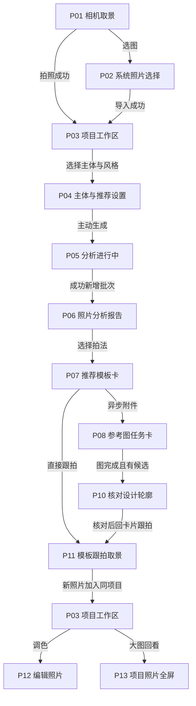
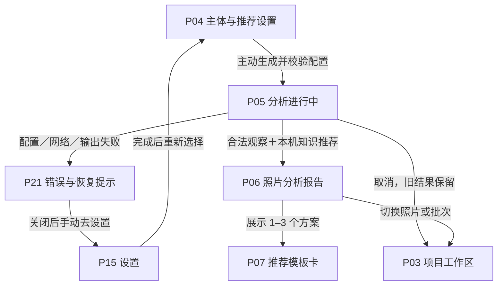
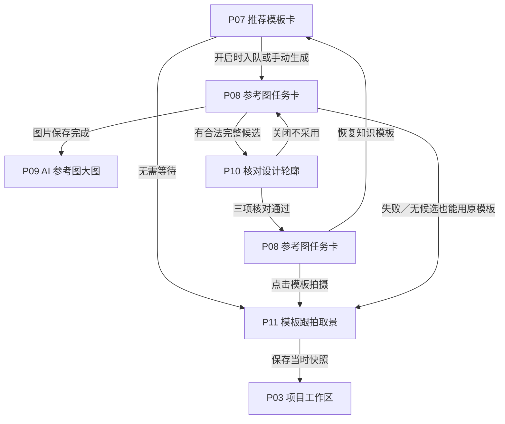
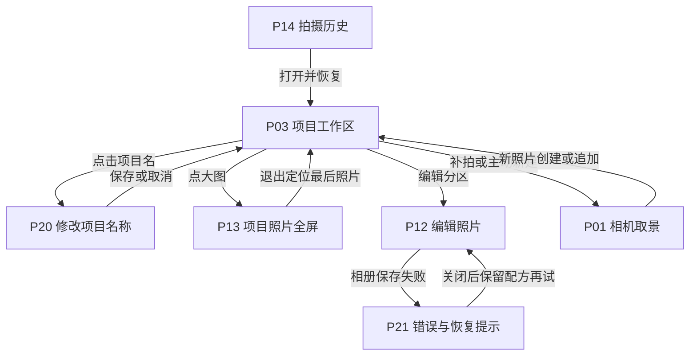
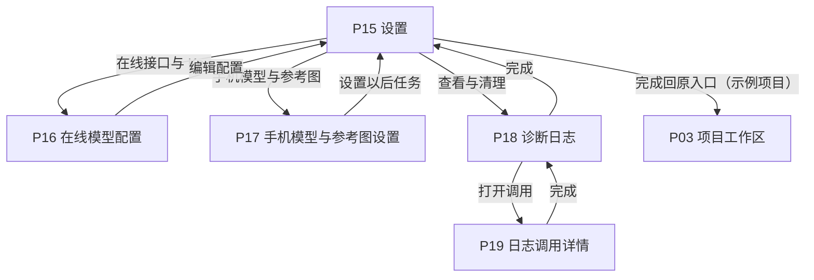
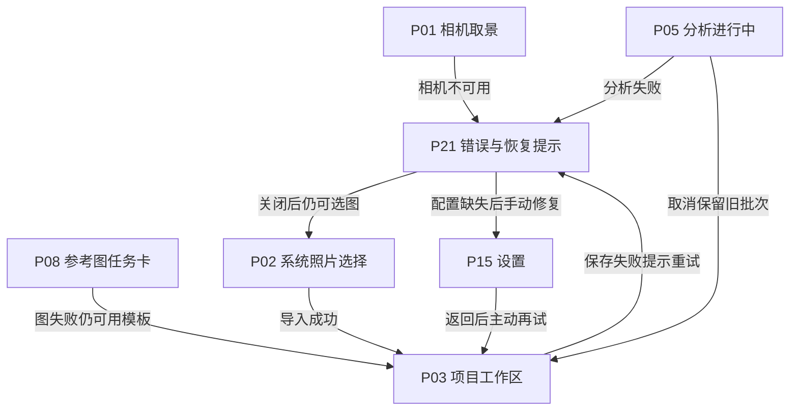
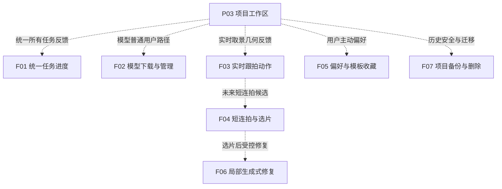

# Melody 相机页面流程图

版本 v0.2 · 2026-10-04。由 review-data.json 生成。截图节点见 [交互评审稿](评审稿.html)，图片来源见 [截图说明](assets/README.md)。实线表示已有交互关系；规划单独用虚线。P 编号可在 [页面规格](页面规格.md) 定位。系统返回均回原入口，图中的项目/相机出口是相应场景的示例。

## L01 完整拍摄主线

实线表示当前已有入口；单元编号包括页内区域，不等于逐级跳转。参考图是并行支线。

## L02 分析与推荐

成功新增批次；失败和取消保留旧结果。没有可靠轮廓仍可生成保守方案。

## L03 参考图与新轮廓

任何等待、失败或无法提取，都保留原模板；采用与撤回只影响以后跟拍。

## L04 回看编辑与历史

照片和配方按各自来源恢复；保存到相册与保存项目是两个动作。

## L05 设置模型与日志

配置修改不自动发送照片。P16/P17 属于设置页分区；日志另有弹层。

## L06 异常恢复与取消

错误返回原操作，不固定跳首页。后台或取消后拒收旧响应；保存失败有原位重试。

## L07 下一阶段扩展

全部虚线为规划关系，不是当前可用入口；优先级见 PRD，尚未确认排期。

