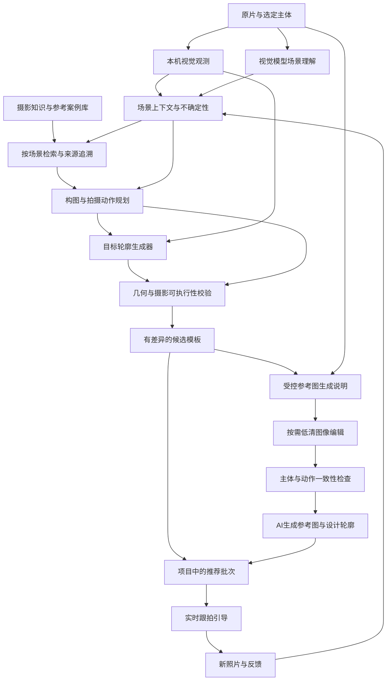

# 场景理解与目标模板推荐引擎

> 当前完整数据流见 [描边 → LLM → 摄影规则 → Qwen → 核对跟拍流程图](知识推荐引擎实现.md#当前完整流程图)，包含各阶段的代码入口，以及原片轮廓、类别几何、生成图轮廓的区别。本文第 3 节是长期目标架构，不能把其中自动质量审核、案例学习和实时反馈理解为当前已实现。

> 2026-10-04 开发分支更新：知识推荐 v1 已进入源码，完整的当前实现以 [知识推荐引擎实现](知识推荐引擎实现.md) 为准，调研和选型见 [ADR 007](adr/007-知识驱动摄影推荐.md)。本文件下文保留上一版的分析与长期规划。Swift 测试、iOS 模拟器构建及公开照片流程已经验证；摄影效果、真实模型新合约和真机体验未验收。

> 当前参考图执行位置（2026-10-03）：此 iPhone 内嵌 Draw Things / Qwen Image Edit。Mac 中转选型已撤销；分辨率默认 512 × 512，统一全局列表并写入任务快照。具体实施边界见 [ADR 005](adr/005-iPhone端侧参考图.md)，文中涉及 Mac 的早期调研不代表当前产品路径。

更新：2026-10-04。当前已实现知识卡检索、风格排序、目标参数搜索、有限类别几何及生成图轮廓人工核对选用；自动质量认证、案例库学习和实时跟拍反馈仍为规划。下面 2.1 节保留 v1 之前的算法作为对照，不代表当前实现。

用户定位：这是产品最有技术含量的核心功能。分析场景以后，结合摄影技巧与参考案例生成**新的目标轮廓**；最初可以粗略，后续逐渐精细。不是仅把原照片的边缘搬到另一处。当前版本可以简单，但架构必须能持续扩展。

## 1. 输出应当是什么

一次推荐输出前三种必需内容，以及可选的生成参考图：

1. **观察**：当前画面里实际可见的主体、位置、姿态、光线、背景、遮挡，以及不确定的部分。
2. **目标模板**：希望下一张照片出现的主体比例、位置、姿态、视角、轮廓与留白。目标是设计稿，不是当前画面的检测结果。可以先由粗轮廓/体块表达，并标明精度。
3. **执行步骤**：摄影者怎么移动、手机如何抬低、主体怎样转向、推荐倍率，以及操作顺序。无法通过合理现场动作实现的模板不应推荐。

4. **生成参考图（基础分支已实现）**：以当前原图为身份参考，把推荐文案、目标轮廓和机位转成低分辨率效果草稿，帮助理解下一张的视觉目标；明确标注“AI 生成参考”，不能混入实拍照片。

例如拍可乐瓶：观察识别“瓶子、桌面、侧光、杂乱背景”；检索“产品侧逆光、三分留白、低机位体积感”等知识；生成三种有不同机位与留白的瓶身目标示意；选定后用相机引导用户靠近、移位或转动瓶子。新轮廓可以依据几何先验和参考构图设计，不应声称单张图真实恢复了瓶背面的商标。

## 2. v1 前的基础与缺口（2026-10-03 历史对照）

| 模块 | 已有实现 | 当前缺口 |
|---|---|---|
| 像素几何 | Apple Vision 前景实例分割、简化轮廓、主体选择 | 尚无实时跟踪、人体关键点、复杂背景质量评估 |
| 场景观察 | DeepSeek Flash 在线图像输入、Gemma 4 E2B 本机图像输入 | 尚无多模型融合、结构化场景图、摄影知识检索 |
| 推荐 | 提示词请求观察、动作、目标框、倍率、受控机位枚举 | 没有经知识库支撑的新轮廓合成，模型也可能给出不合理动作 |
| 目标图 | 对实际分割轮廓等比缩放与平移；机位示意图 | **这不是新的视角轮廓，也不是3D重建** |
| 生成参考图 | iPhone 内 Draw Things / Qwen Edit，异步卡片、全局尺寸、取消/重试、持久恢复 | 尚无主体/角度自动审核、设计轮廓提取或通用模型下载器 |
| 校验 | JSON结构、文本长度、有限数、范围、倍率、重复ID | 尚无摄影可执行性和技巧依据校验 |
| 项目上下文 | 拍摄项目→照片→多轮推荐，跟拍照片记录引用 | 尚未用前后照片反馈改进推荐 |

主体分割模型（包括 SAM / EdgeTAM）回答“物体在哪些像素”，不直接回答“怎样拍好”，也不直接生成未知视角。大语言视觉模型负责理解与规划，几何/生成模块负责构建目标。

### 2.1 2026-10-03 旧版代码链路复核

本节记录 2026-10-03 的旧版算法，已由知识推荐 v1 替代，保留用于回答旧实现如何工作。当前从参考图提取设计轮廓和人工核对选用已接入；完整实现见 [知识推荐引擎实现](知识推荐引擎实现.md)。

1. `SubjectSegmenter.outlines` 在原照片上执行 Apple Vision 前景实例分割，再检测遮罩轮廓，最多取 6 个实例、每实例 16 条外轮廓；多边形简化 epsilon=0.003，每条最多 512 点。坐标转换为左上原点，过滤包围框面积不大于 0.002 的结果，按包围框面积降序排列。应用恢复已有主体选择，否则默认选第一个；分割失败只显示目标范围。
2. `PhotoAnalysisPrompt` 将原片缩略图交给在线视觉或 Gemma，一次返回观察报告与 1–3 个 `ShotPlan`，包括动作、理由、倍率、受控机位和下一张照片的目标框。目标框由模型给出，没有独立算法从分析文章计算最优构图。`detectedSubject` 仅作报告字段与范围校验，未用于主体轮廓匹配、位置优化或生图几何控制。
3. `PhotoAnalysisCodec` / `PlanCodec` 检查 JSON、文字长度、唯一 ID、坐标和可用倍率；这是数据合法性检查，不是摄影美学评分或现场动作可执行性检查。独立的离线练习入口 `OfflineDirector` 使用三组固定目标框，不声称读懂了照片。
4. `SubjectOutline.placed` 只执行等比缩放和平移。记原轮廓包围框为 `(bx, by, bw, bh)`，原图宽高比为 `a`，目标框为 `(tx, ty, tw, th)`，显示画布宽高比为 `c`：`r = bw*a/bh`，`w = min(tw, th*r/c)`，`h = w*c/r`，`x0 = tx+(tw-w)/2`，`y0 = ty+(th-h)/2`。原轮廓点 `(px, py)` 映射为 `(x0+(px-bx)/bw*w, y0+(py-by)/bh*h)`。结果保持物理形状比例，在目标框内居中，未填满的方向留空。没有旋转、透视、姿态修改或新视角重建。
5. `CompositionOverlay` 的九宫格只是绘制在 1/3、2/3 位置的参考线，不参与目标框计算，也不把模板吸附到九个位置。`CameraViewpoint` 影响文案和机位示意，不改变实际轮廓几何。
6. 若启用参考图，`StudioModel.analyzePhoto` 在推荐保存后为各方案排队；`ReferenceImageRequest.prompt` 将动作、机位和目标框写成文字，连同原图输入 iPhone 内的 Qwen Edit。引擎当前传入 `mask:nil`、`hints:[]`，没有独立几何控制图。输出校验尺寸、大小、可解码性并重新编码后保存到该推荐，不作主体身份/角度一致性审核，也不再次分割生成图。
7. 选择跟拍方案后，相机设置推荐倍率，取景器叠加原轮廓摆位结果，并保存跟拍来源快照。尚无实时主体差距检测、对齐反馈或评分。参考图与静态模板是同一方案的两个分支，生成图不会自动替换跟拍描边。

例如原图为平视瓶子、方案建议偏右俯拍：当前描边仍是原来的平视瓶子形状，只改变位置和大小；生成参考图可能呈现俯拍效果，两者尚未通过设计轮廓闭合。后续需要“参考图核对 → 设计轮廓提取 → 用户选用 → 跟拍”的独立步骤。

## 3. 分层架构

SDK、网络与模型生命周期留在适配层；Core 只定义可序列化领域数据和纯校验规则。保留现有 `PhotoAnalyzing` 接口，以版本化适配器兼容旧报告。不要把模型调用塞进 SwiftUI。

### 3.1 Scene Understanding / 场景理解

输入：转正压缩图、明确选定主体、设备支持倍率、当前拍摄项目的必要上下文。

输出 `SceneEvidence`（规划）：

- subject：类别、候选主体、选择依据；人物与商品使用不同规则。
- geometry：实例轮廓/关键点/检测框及其来源、置信度；**模型估计框与本机像素轮廓分开保存**。
- lighting/background：可见光影、干扰、层次、留白和地平线。
- constraints：画幅、设备倍率、可选机位、主体是否可移动等；无法从图像确定的约束需说明或由用户选择。
- uncertainties：遮挡、反光、透明材质、不可见表面等未知量。

置信度必须来自实际模型接口或可测证据，不能让文案模型随意编造精度数字。必要时请求用户选择主体或补一张参考图。

### 3.2 Photography Knowledge / 摄影知识

同时支持可解释规则和经整理的参考案例，而不是仅换一个“摄影大师”提示词。

`TechniqueCard`（规划）：唯一ID、版本、标题、适用主体/场景/光线、构图原则、前提条件、建议动作、失败条件、关联案例、出处和许可。

首批可由项目自行编写：三分留白、居中对称、负空间、低机位体积感、前景层次、背景分离、商品侧逆光、人物视线空间。没有实际光源/反光板时，不推荐要求凭空改变照明的动作；不能仅依据明暗断言灯具类型。

`ReferenceComposition`（规划）：合法参考素材/自有拍摄、类别、画幅、主体框/简化轮廓、机位、光线结构、动作约束、审阅结果。优先提取构图关系和几何先验，避免未经授权复制参考照片的特定外观。

检索第一步使用标签与规则过滤；有足够已审核案例后再引入 embedding 检索与重排。每条推荐保留使用的 TechniqueCard / Reference ID 和版本，能解释“为什么适合这张照片”。知识库不是任意联网搜索的未验证结果。

### 3.3 Composition Planner / 构图规划

综合场景、技巧、设备和用户目标生成少量有明显差异的候选，输出：

- 推荐目标（突出主体/环境叙事/强调体积等）与技巧依据。
- 目标框、留白、倍率、机位、主体朝向、动作顺序。
- 新轮廓所需的几何参数和精度预算。
- 可执行条件、失败原因、替代动作。

先用规则确定硬约束，再让模型做场景关联与文字解释。避免三张卡只换标题、结构相同；区分移动相机、转动主体、改变焦段，不能混成相互矛盾的指令。重复生成应知晓本张照片已有的推荐，选择新技巧/构图；这属于后续能力，当前重复调用没有去重质量承诺。

### 3.4 Target Outline Generator / 新轮廓生成

按精度逐步实现，所有结果明确标注 `designedTarget`，绝不冒充 `observedOutline`：

- **粗略**：受控几何体块/轮廓。瓶罐可用轴线、瓶身宽度、收口、底部与顶部椭圆等参数表达；人物可用骨架与简化体段表达姿态。改变机位时投影几何先验，不能简单旋转整张2D边缘冒充透视变化。
- **结构化**：结合参考构图的骨架/轮廓、类别形状先验和当前主体比例，对目标做形变约束；保持合理身体/物体结构，允许用户调整目标松紧。
- **精细**：有足够依据时使用条件生成或多视图几何；单张图不能确认的表面必须保留“设计示意/生成内容”标记。不得默认调用昂贵图像生成服务或上传原片。

输出受控点列、曲线控制点或有限几何图元。限制路径数、顶点数、范围、复杂度，禁止执行模型 SVG/HTML/代码。粗略轮廓允许柔边或半透明带表达容差；不能用视觉模糊掩盖无效结构。

### 3.5 Recommendation Validator / 校验与退化

现有结构校验之外增加：

- 目标几何有效、不越框、比例和遮挡合理；与镜头画幅一致。
- 动作与目标是否一致：提示后退不能同时在相同倍率下要求主体显著变大；机位、光线建议不相互冲突。
- 当前设备倍率可用、变焦不是声称未提供的镜头；没有现场条件时不承诺效果。
- 每个技巧引用有效且适用于当前场景；模型输出和检索材料一律作为数据，不能覆盖系统/用户指令。
- 无依据的新视角退化为粗略目标和明确动作，或者拒绝该候选。退化来源与原因在界面可见。

### 3.6 Live Coach / 跟拍反馈

选择模板后低频使用 Vision 观测实时主体/关键点，与目标比较中心、比例、关键点关系、留白等。只提示一个当前最重要且有可靠依据的动作；加稳定时间、滞回、低置信度静默，避免指令抖动。检测框匹配不代表角度已经正确，也不自动代表拍得更好。

跟拍照片关联 `referencePhotoID + batchID + planID`（本轮已经记录），未来可以用前后对比判断动作是否达成。用户是否喜欢是独立反馈，不等同于几何对齐，更不能变成人物外貌打分。

## 4. 项目与数据版本（规划）

产品维度：拍摄项目 `ShootingProject` → 照片 `ProjectPhoto` → 多轮推荐 `RecommendationBatch` → 模板。跟拍产生同项目新照片，而不是覆盖参考原片。每张照片拥有独立编辑配方，历史进入后可以继续。

后续版本化数据建议：

| 数据 | 必需内容 |
|---|---|
| SceneEvidenceV1 | photoID、来源、时间、模型版本、几何、场景标签、不确定性 |
| TechniqueReference | techniqueID、版本、案例ID、采用原因、适用约束 |
| TargetTemplateV1 | 独立ID、父照片/批次、目标类型、机位、范围、受控轮廓、容差、精度标签 |
| RecommendationTrace | provider/model/promptVersion/knowledgeVersion、耗时、校验状态、退化原因（不存Key、请求图像正文或定位） |
| FollowUpCapture | 参考照片、批次、模板、新照片ID、可选达成情况/用户反馈 |

采用元数据版本迁移；旧报告不可静默伪装成新引擎产物。当前文件存储的 schema 演进需要先补兼容测试，不能直接重写全部历史。图片单独存储，元数据只关联ID。

## 5. 实施里程碑与验收

1. **当前版本：工作流地基。** 完成默认取景、同项目多照片/多轮推荐/跟拍引用、自动保存、历史恢复。现有模板等比摆放原轮廓，界面明确边界。
2. **摄影知识 + 粗目标。** 首批自写 TechniqueCard、标签检索、可追溯技巧引用；对人物/瓶罐各支持有限新轮廓类型和可执行性校验。用明确类别测试，不宣称支持任意物体。
3. **参考结构与推荐差异。** 引入有许可案例、类别形状先验、检索重排和跨轮去重；验证相比纯提示词方案的收益。
4. **实时跟拍闭环。** Vision跟踪/关键点对齐、动作反馈、拍前拍后比较；真机验证帧率、延迟、取消、热状态和电量。
5. **精细目标与偏好。** 在可测收益下才引入条件生成、多视图和可撤销偏好；清楚区分事实检测与创作设计。

评估集需涵盖瓶罐、人物、透明/反光物体、复杂背景、低光、遮挡、不同画幅。固定样本验证结构与坐标；真机测试可执行性；人工比较摄影建议是否具体、合理、有差异。分别记录分割失败率、合约通过率、建议重复率、动作达成率、用户选择与放弃、耗时/内存/热状态。不要用单张成功样图冒充质量基准，不使用虚构评分。

## 6. 隐私、成本与交互

本机视觉默认不上传。在线推理仅在用户选择在线模型并点击生成时发送必要缩略图；知识检索不应携带Key或私人原图。默认不做跨用户历史训练，也不自动云同步项目。采集偏好或反馈上传须独立设计与授权。

耗时阶段对应用户要求的进度条：准备图像、观测、检索、规划、生成轮廓、校验。可测工作量给真实百分比，未知服务端阶段给阶段/等待时间或显式标注的预计值，不能把请求已发送说成模型完成80%。该统一进度交互仍待实现。

## 7. 快速参考图生成分支（基础已实现，增强项规划）

在文字和粗目标已可用后，可按需把一个候选扩展成低清视觉草稿。它与实时相机、场景分析解耦，生成失败或超时仍可照原模板拍摄。Qwen 图像编辑、角度 LoRA、手机/Mac 路线、官方证据和实验边界见 [参考图生成调研](参考图生成调研.md)；基础协议、手机推理与卡片已实现；以下 ReferenceBriefV1 / ReferenceDraftV1、自动质量审核及设计轮廓为增强设计，尚未落地。

### 7.1 数据流与接口

`ReferenceImageGenerating` 作为单独 provider 协议；不复用只返回 JSON 的 `PhotoAnalyzing`，也不将 SDK 放入 MelodyCore。当前 App 层适配器实现 iPhone 端侧；未来可接用户明确选择的改图 API，Mac 客户端只保留历史实验，视图只发出生成/取消动作。

`ReferenceBriefV1` 包含 sourcePhotoID、batchID、planID、选定主体、方位/俯仰/距离、目标范围、画幅、可用现场动作、主体必须保留的属性，以及输出像素预算。机位由受控值映射提示，模型文案按数据处理；单独的控制图是模型可选能力，不能把描边涂在原片上就声称是 ControlNet。必要时输入原缩略图和标注控制图两张参考，并检查模型支持和引用顺序。

`ReferenceDraftV1` 包含来源关联、任务 ID、生成图文件 ID、设计轮廓、provider/model/revision、LoRA版本、seed、分辨率、量化/步数/提示版本、实际耗时、审核状态和失败原因。图像单独保存；不记录 Key 或上传正文。生成图独立附着于模板，不能增加实拍照片数量，不能成为原片或自动训练素材。

任务状态：排队 → 准备/加载模型 → 编码参考 → 去噪步骤 → 解码 → 校验 → 完成/失败/取消。只有有回调的去噪步骤才能给 step/total 百分比；下载与解码分阶段表示，不伪造整个流程完成度。结果提交前校验 photo/batch/plan/job ID；切换项目、取消及迟到结果不能串到当前模板。

### 7.2 先可看，再决定可跟拍

参考图先检查文件大小、尺寸、可解码性；再检查主体身份/数量、文本与标志漂移、目标机位、比例、留白，以及与现场动作的一致性。视觉模型自评只作辅助，不当成保证。没有检测到可靠主体时，不凭空输出描边；生成出的不可见表面只作为设计示意。

通过检查后，Vision 可从参考图提取 `designedOutline`，再按既有受控路径规则限制顶点与范围；其来源必须标明“从生成参考图提取”，区别于当前照片实际分割的 `observedOutline`。未经用户选择，不自动替换当前正在跟拍的模板。模板角度和相机倍率独立；参考图不随切换 0.5×/1×/2× 重新生成或消失。

### 7.3 缓存、资源与里程碑

当前在参考图开启时为每个推荐项排队，手机一次生成一张；以项目/照片/批次/方案关联作业，已有完成结果可复用，用户可重新生成。未来增强缓存可加入 brief/engine/model/adapter/prompt 版本、seed 和 size；“只为用户选定项生成”是可选优化，不是已实现行为。当前进入后台取消活动任务，保留文字与模板；Gemma 与 Qwen 共用串行模型槽。过热/低内存自动退让尚未实现。当前无跨设备生成目标；未来 API 配置不继承在线分析的地址或凭据。

新增里程碑位于“摄影知识 + 粗目标”之后：先用公开样图完成低清条件编辑可行性对照，再建立 provider 与任务缓存，最后将合格参考图的设计描边接入跟拍。拍摄历史中比较的是实拍与参考目标，不能把生成样图当成拍摄成功证据。

### 7.4 首个落地版本

2026-10-03 先增加 `ReferenceImageGenerating`、按 project/photo/batch/plan 关联的持久作业与推荐卡片，随后撤销 Mac 中转，改为此 iPhone 内嵌官方 Draw Things 引擎。新推荐先显示模板，参考图独立排队；现有推荐可以补图。当前实现与验证边界见 [ADR 005](adr/005-iPhone端侧参考图.md)，早期接口过程保留在 [ADR 004](adr/004-异步参考图与本地生成服务.md)。v1 已补设计轮廓提取和人工核对选用；自动身份/角度认证、LoRA 对照仍未实现。
