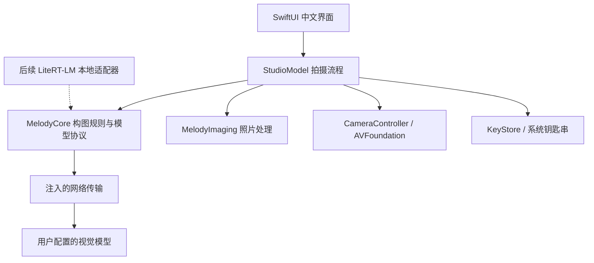

# 领域与模块设计

先读根目录 CONTEXT.md，它只存储领域语言。技术决定在 ADR，执行范围在产品规划。

## 当前依赖关系

| 模块 | 对外接口与职责 | 隐藏的复杂度 | 验证方式 |
|---|---|---|---|
| MelodyCore | `OfflineDirector.plans`、`VisionDirecting.recommend`、`PlanCodec.decode` | 离线摄影规则、模型消息、坐标和能力验证 | Swift Testing；无 UI 与相机依赖 |
| MelodyImaging | `load / crop / render / jpeg` | EXIF 朝向转正、下采样、Core Image 调色、干净 JPEG 编码 | 实际像素与文件往返测试 |
| CameraOperating / CameraController | `start / setZoom / capture / stop` | 权限、串行会话、物理倍率映射、回调超时 | 可暂停替身测流程；硬件行为需要 iPhone |
| StudioModel | 拍摄、分析、选择方案、导入与导出动作 | 任务取消、来源切换、状态、原片与编辑版本、倍率恢复 | 应用流程测试 |
| NetworkTransport | `send(URLRequest)` | actor 隔离、临时会话、超时、响应体上限、拒绝重定向 | 当前核心测试注入固定传输；真实网络待验收 |
| SwiftUI Views | 显示状态和发送用户动作 | 自适应布局、无照片叠加导出、照片编辑 | 离屏渲染；锁屏导致本次没有 UI 点击验收 |

没有为了未来功能创建空壳目录。VisionDirecting 是用户明确要求的在线/本地替换点；当前真正的视觉适配器是 OnlineDirector，离线规则不伪装成视觉适配器。将来本地推理返回同一 ShotPlan，但拥有自己的模型资源生命周期。

## 数据规则

- ObservationFrame：已转正 JPEG + 采样倍率；最多 3 张，每张最大 2 MB。相机采样下采样至最长边 1024。
- ShotPlan：id、中文标题、可执行动作、理由、倍率和 SubjectBox。模型原始 JSON 不进入视图。
- SubjectBox：左上原点，归一化坐标 x/y/width/height；四值有限，宽高为正，范围不越界。
- PlanCodec：拒绝空结果、超过 3 项、重复 ID、过长文本、不支持的倍率、坐标异常及错误 JSON。允许常见 JSON 代码围栏，但不任意截取可能掩盖错误的内容。
- Original：真机保留拍摄返回的原始 Data；导入保留原始文件 Data。显示/调色使用下采样图，因此编辑副本可能低于原片分辨率（导入最长边 2400，真机 4096）；这项限制在后续做全分辨率后台导出时解除。
- EditRecipe：当前由 ColorStyle + amount 表示，原片对比不修改配方。保存副本根据当前配方重新计算，避免保存上一次预览。
- 保存原片保留源格式；调色副本为 JPEG，重新编码不携带原片 EXIF/GPS。上传也只走重新编码的缩略图。

## 坐标与相机约定

首版 iPhone 只支持竖屏，后置相机。采集与预览设置为竖直方向，取景采用完整 3:4 画幅，避免随意裁掉上下内容。导入照片按其真实比例显示；框的归一化坐标相对该照片。前置镜像和横屏目前不在范围内，加入之前必须补坐标变换测试。

iPhone 虚拟多摄设备的 videoZoomFactor 不一定等于系统相机 UI 的倍率。CameraController 使用虚拟设备切换倍率，将主摄映射到 1×；候选 0.5/1/2 经设备 min/max 能力过滤。这不是承诺每个倍率都在使用独立物理镜头；虚拟设备会根据光线等条件选择镜头，必须真机验证。首版不硬编码 iPhone 17 Pro Max 的镜头参数，也未覆盖 4×/8× 的最佳成像策略。

多倍率观察是依次设定倍率、等待约 450 ms、采集照片再压缩。此等待不能保证每次自动曝光/对焦都稳定；下一版用取景流时间戳和稳定条件。人物运动可能使三张不一致，提示中明确说明是顺序图。无论成功失败均尝试恢复原倍率，单次相机捕获有 12 秒超时。

## 交互状态与错误

拍摄/分析期间 busy 防重入；Task 支持取消并丢弃取消后的响应。更换场景/来源清空原方案，后台停止相机。在线缺少同意或配置时在网络前退出；不默默切换服务商或把离线结果冒充 AI。

在线传输使用 ephemeral 会话，不缓存 HTTP 响应；不跟随重定向；最大读取 256 KB 响应；HTTP 状态码转换为中文错误，不将服务商原始响应中的可能敏感内容直接显示。没有后端、不携带用户位置、不写图像日志。用户输入自有 Key 存储在本机钥匙串，设置文件只存 URL 与模型 ID。上传开关只在内存，重新启动默认关闭。

## 后续模块的真实切分条件

1. **GeometryCoach**：输入 Vision 观测到的人体框/关键点 + 目标框，输出“向左/退后”等可解释动作。它必须区分“没检测到”与“已经对齐”。先用 Apple Vision，是否引入 OpenPose 由端侧质量与许可评估决定。
2. **LocalVisionDirector**：加载卸载模型、内存预算、推理取消、热状态退让；只输出合法方案。下载、校验、版本与许可由独立模型资产管理承担。
3. **PhotoSelection**：短连拍候选集 → 候选理由。先处理眨眼和模糊，再讨论偏好排序。
4. **GenerativeRepair**：原片 + 区域掩膜 + 明确修改意图 + 可选参考帧 → 新版本。图像生成 provider 与视觉理解 provider 分开配置。
5. **Python 网关（有需要再加）**：适合试验开源修图管线、服务商归一化、团队密钥与成本控制。不会直接控制 iOS 摄像头。个人 BYOK 首版不需要服务器。
