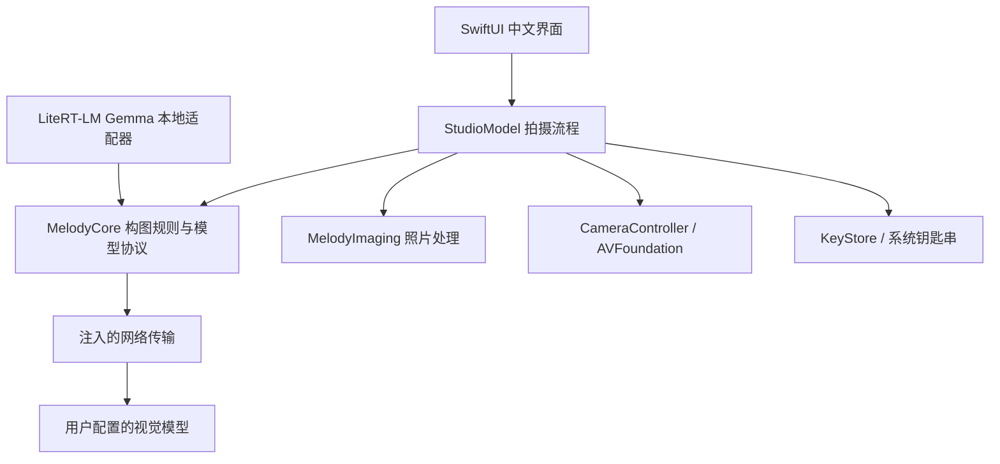

# 领域与模块设计

## 知识推荐开发分支增量（2026-10-04）

`PhotoAnalyzing → SceneEvidence → PhotographyKnowledge / RecommendationEngine → ShotPlan + CompositionDesign`：模型给观察，本机知识规则检索适用技巧、搜索目标参数并输出受控几何与操作步骤。`ReferenceGenerationController → SubjectSegmenter → ReferenceDesign → 用户核对 → planSnapshot`：生成图分割后可选用新轮廓，跟拍保存不可变方案快照。Core 仍只有 Foundation 数据与规则；像素分割、模型引擎与 UI 边界不变。

该分支已经运行 Swift 测试、iOS 模拟器构建与公开照片流程回归，具体结果和未验项目见 [会话总结 2026-10-04](会话总结-2026-10-04.md)。真实模型新合约及真机摄影效果仍需分别验证。

先读根目录 CONTEXT.md，它只存储领域语言。技术决定在 ADR，执行范围在产品规划。

## 当前依赖关系

| 模块 | 对外接口与职责 | 隐藏的复杂度 | 验证方式 |
|---|---|---|---|
| MelodyCore | `OfflineDirector.plans`、`VisionDirecting.recommend`、`PlanCodec.decode` | 离线摄影规则、模型消息、坐标和能力验证 | Swift Testing；无 UI 与相机依赖 |
| MelodyImaging | `load / crop / render / jpeg` | EXIF 朝向转正、下采样、Core Image 调色、干净 JPEG 编码 | 实际像素与文件往返测试 |
| CameraOperating / CameraController | `start / setZoom / capture / stop` | 权限、串行会话、物理倍率映射、回调超时 | 可暂停替身测流程；硬件行为需要 iPhone |
| StudioModel | 拍摄、分析、选择方案、导入与导出动作 | 任务取消、来源切换、状态、原片与编辑版本、倍率恢复 | 应用流程测试 |
| NetworkTransport | `send(URLRequest)` | actor 隔离、临时会话、超时、响应体上限、拒绝重定向 | 当前核心测试注入固定传输；公开样图真实请求已验证 |
| SwiftUI Views | 显示状态和发送用户动作 | 自适应布局、无照片叠加导出、照片编辑 | 模拟器实际点击与截图；真机手势/权限验收按最新验证记录单列 |

没有为了未来功能创建空壳目录。VisionDirecting 是用户明确要求的在线/本地替换点；当前包含 OnlineDirector、OnlinePhotoAnalyst 和 GemmaPhotoAnalyst；照片分析共用 PhotoAnalyzing 与报告校验，离线规则不伪装成模型。Gemma 与 Qwen 通过 App 层共享模型槽管理生命周期。

## 数据规则

- ObservationFrame：已转正 JPEG + 采样倍率；最多 3 张，每张最大 2 MB。相机采样下采样至最长边 1024。
- ShotPlan：id、中文标题、可执行动作、理由、倍率和 SubjectBox。模型原始 JSON 不进入视图。
- SubjectBox：左上原点，归一化坐标 x/y/width/height；四值有限，宽高为正，范围不越界。
- PlanCodec：拒绝空结果、超过 3 项、重复 ID、过长文本、不支持的倍率、坐标异常及错误 JSON。允许常见 JSON 代码围栏，但不任意截取可能掩盖错误的内容。
- Original：真机保留拍摄返回的原始 Data；导入保留原始文件 Data。显示/调色使用下采样图，因此编辑副本可能低于原片分辨率（导入最长边 2400，真机 4096）；这项限制在后续做全分辨率后台导出时解除。
- EditRecipe：当前由 ColorStyle + amount 表示，原片对比不修改配方。保存副本根据当前配方重新计算，避免保存上一次预览。
- 保存原片保留源格式；调色副本为 JPEG，重新编码不携带原片 EXIF/GPS。上传也只走重新编码的缩略图。

## 坐标与相机约定

首版 iPhone 只支持竖屏，后置相机。采集与预览设置为竖直方向，取景采用完整 3:4 画幅，避免随意裁掉上下内容。导入照片按其真实比例显示；框的归一化坐标相对该照片。前置镜像和横屏目前不在范围内，加入之前必须补坐标变换测试。

iPhone 虚拟多摄设备的 videoZoomFactor 不一定等于系统相机 UI 的倍率。CameraController 使用虚拟设备切换倍率，将主摄映射到 1×；候选 0.5/1/2 经设备 min/max 能力过滤。这不是承诺每个倍率都在使用独立物理镜头；虚拟设备会根据光线等条件选择镜头，必须真机验证。首版不硬编码 iPhone 17 Pro Max 的镜头参数，也未覆盖 4×/8× 的最佳成像策略。

多倍率观察是依次设定倍率、等待约 450 ms、采集照片再压缩。此等待不能保证每次自动曝光/对焦都稳定；下一版用取景流时间戳和稳定条件。人物运动可能使三张不一致，提示中明确说明是顺序图。无论成功失败均尝试恢复原倍率，单次相机捕获有 12 秒超时。

## 交互状态与错误

拍摄/分析期间 busy 防重入；Task 支持取消并丢弃取消后的响应。更换场景/来源清空原方案，后台停止相机。在线缺少必要配置时在网络前退出；只有选择在线并主动生成才请求；不默默切换服务商或把离线结果冒充 AI。

在线传输使用 ephemeral 会话，不缓存 HTTP 响应；不跟随重定向；最大读取 256 KB 响应；HTTP 状态码转换为中文错误，不将服务商原始响应中的可能敏感内容直接显示。没有后端、不携带用户位置、不写图像日志。用户输入自有 Key 存储在本机钥匙串，设置文件只存 URL 与模型 ID。按 2026-10-03 用户要求取消上传开关：选择在线模型并点击生成推荐即发起该次请求；拍照、导入、切换历史不自动上传，本地模式不上传。

## 后续模块的真实切分条件

1. **GeometryCoach**：输入 Vision 观测到的人体框/关键点 + 目标框，输出“向左/退后”等可解释动作。它必须区分“没检测到”与“已经对齐”。先用 Apple Vision，是否引入 OpenPose 由端侧质量与许可评估决定。
2. **LocalVisionDirector**：加载卸载模型、内存预算、推理取消、热状态退让；只输出合法方案。下载、校验、版本与许可由独立模型资产管理承担。
3. **PhotoSelection**：短连拍候选集 → 候选理由。先处理眨眼和模糊，再讨论偏好排序。
4. **GenerativeRepair**：原片 + 区域掩膜 + 明确修改意图 + 可选参考帧 → 新版本。图像生成 provider 与视觉理解 provider 分开配置。
5. **Python 网关（有需要再加）**：适合试验开源修图管线、服务商归一化、团队密钥与成本控制。不会直接控制 iOS 摄像头。个人 BYOK 首版不需要服务器。

## 拍后分析与模板回到取景（2026-10-03）

PhotoEditor 提供独立「分析照片并推荐模板」入口，StudioModel 负责用户主动生成的触发、配置、任务取消及原片绑定。OnlinePhotoAnalyst 位于 MelodyCore，复用注入的网络传输；仅发送一张重新编码、最长边 1024 的原片预览缩略图。用户选择在线模型并点击生成推荐才请求；没有额外上传开关。

PhotoAnalysisCodec 验证报告字段非空、各段最多 400 字、总 JSON 不超过 32 KiB，并复用 PlanCodec 校验 1–3 个模板的 ID、文字、倍率和人物框。UI 只呈现文本与 CompositionOverlay，不执行模型代码或外链。报告包含判断边界，不提供数字评分。演示画面的结果单独标为非实拍。

应用模板先启动相机、重新验证当前设备倍率，再设置倍率和显示轮廓；失败保留照片编辑页。取消或进入后台会丢弃迟到的分析响应；重新拍摄清空当前展示的报告，新旧照片各自保留绑定结果。报告与照片已升级为项目持久化，真实 provider 已用公开样图验证；复杂真实场景质量仍需验收。

## 主体模板与多供应商（2026-10-03）

`SubjectSegmenter`（MelodyImaging）从原图生成本机实例 mask / 轮廓；`SubjectOutline`（Core）限制路径规模并负责目标位置的等比变换。`PhotoAnalyzing` 抽象照片观察，云端和 LiteRT-LM Gemma 共用报告 codec。`PhotoAnalysisSchema` 给 Gemma 提供约束解码，业务 codec 仍校验坐标相加、倍率和 ID。PhotosPicker 将用户选定的原始数据交给 StudioModel，UI 不接触网络。

详情和不采用大一统 Swift AI SDK/Meta 权重的原因见 [ADR 002](adr/002-照片模板与视觉供应商.md)。Meta EdgeTAM 是候选，当前真实分割实现为 Apple Vision；旧版新角度只给机位示意；v1 增加有限类别几何与用户核对后的生成图轮廓，均不伪造重建图片。

## 拍摄项目与历史（2026-10-03）

`ShootingProject` 包含 `ProjectPhoto`，照片保存多个 `RecommendationBatch` 与独立调色配方，跟拍引用 `CaptureReference`。原片独立保存，`ProjectLibrary` actor 原子写项目元数据，StudioModel 串行排队保存；恢复时重新校验模型报告，不记录 Key 或在线请求图像正文。

启动默认取景；拍摄或选择第一张图创建项目，后续照片追加到项目。PhotoEditor 已成为主项目工作区而非独立拍后弹窗；取景/项目切换不新建 session，只有明确的新建动作创建新项目。失败生成保留上一轮，历史恢复当前照片与编辑配方。见 [ADR 003](adr/003-拍摄项目与历史.md)。

新目标轮廓、摄影知识检索、几何合成和跟拍闭环为后续核心架构，见 [推荐引擎架构](推荐引擎架构.md)；当前代码没有这些规划中的模块。

## 项目详情与照片查看（2026-10-03）

自动名称随每轮成功报告的 subjectName 更新；手动改名后 titleIsCustom 持久保存，不再覆盖。旧元数据无此字段时默认自动名称。项目首图标为主照片；有 capturedFollowing 的后续图片标为模板跟拍，其他按拍摄/导入区分。

CaptureReference 保存来源照片、批次、方案 ID 和可选真实轮廓快照。方案从不可变推荐批次查找，轮廓解码走范围/数量校验；不使用跟拍后新提取的主体冒充原模板。旧历史没有快照时只叠加对应目标框并提示。

iOS 大图使用 UIKit UIScrollView + UIImageView，支持双指缩放和双击，模板形状随照片共同缩放；模板只用于预览，不写进相册原片/副本。使用 [Apple UIScrollView 缩放接口](https://developer.apple.com/documentation/uikit/uiscrollview/maximumzoomscale)。保存请求使用 addOnly 权限，串行防重复点击，成功/拒绝均有反馈。编辑大图沿用当前配方分辨率；原片查看/保存使用原始文件数据。

## 倍率与全屏画廊修补（2026-10-03）

`chooseZoom` 只改变相机倍率，保留选中方案、描边和跟拍来源；不改写方案推荐倍率。`UIPageViewController` 横向分页承载独立缩放页；缩放超过原比例时暂停父分页，拖动用于查看照片，原比例向下拖动用于返回（短拖回弹）。页码与模板开关跟随当前照片，关闭后恢复项目中最后查看的照片。通过独立 `galleryPhoto` 异步按需读取，不在浏览每一页时触发分割、在线分析或编辑状态变化；原片模式使用原始字节，编辑模式使用该照片自己的配方。加载失败显示说明，仍可切换/退出。

低清参考图已作为独立异步分支接入：推荐卡片先提供模板，此 iPhone 内 Draw Things / Qwen 逐项生成附件。模型协议位于 Core，引擎与持久作业位于 App；权重单独存应用支持目录，不随 App 包重复安装。早期 ADR 004 的 Mac 中转由 ADR 005 替代，见下节及推荐引擎架构第 7 节。

## 当前参考图路径（2026-10-03 纠正）

`推荐 + 原照片 → ReferenceGenerationController → PhoneReferenceProvider → 此 iPhone 内 Draw Things / Qwen Edit → 对应推荐卡片`。Mac 服务路径撤销，生成协议保留以支持将来用户主动选择的改图 API。业务层只持有 `ReferenceResolution` 和请求快照，不引用模型 SDK。具体决策见 [ADR 005](adr/005-iPhone端侧参考图.md)。

## 本机诊断日志

App 层 `DiagnosticLog` 使用 Apple Logger + 可清理的有界本机文件；`ModelDiagnostics` 装饰在线 transport、本地 Gemma/Qwen 记录实际输入输出。视图只读取快照，不构造请求。设置可查看、筛选和清理。正文仅本机存储，密钥/图像正文/EXIF 不入日志，详细决策及限制见 [ADR 006](adr/006-本机诊断日志.md)。
