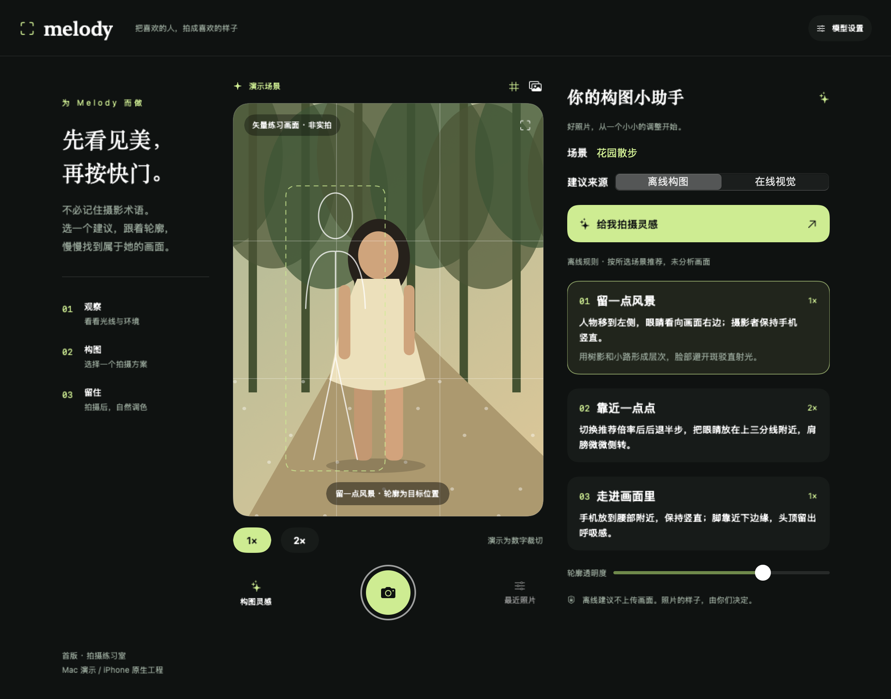

# v0.1 验证记录

## 2026-10-04：公开照片与模拟器回归、跟拍文案修复

用户已授权模拟器和公开照片测试，替代上一节开发时“构建待执行”的限制。本轮在 `codex/knowledge-guided-recommendations` 完成测试与修复，不安装手机、不推送远程。过程见 [会话总结](会话总结-2026-10-04.md)，复现见 [公开照片回归](公开照片回归.md)。下方按日期保留的旧记录仅表示当时版本。

| 命令/检查 | 实际结果 |
|---|---|
| `./scripts/check-environment.sh` | macOS 26.2（25C56）、Swift 6.3.3、Xcode 26.6（17F113）、iOS/Simulator SDK 26.5；iPhone 17 Pro Max / iOS 26.5（23F77）模拟器启动。工具仍列出配对手机，但用户未提供可操作真机，本轮不查询手机系统、不进行手机动作；旧系统版本见 10-03 记录 |
| 初始 `swift test` | 86 个 Swift Testing 定义、8 个 XCTest 通过；当时两个真实集成测试缺参数会空返回，不能算真实模型通过，后已改显式 skipped |
| `swift test --filter adoptedReferenceGuidanceUsesNewTargetInsteadOfOldPlacement` | 修复前 3 个断言失败：生成图轮廓已到右侧而指令仍“偏左”且沿用旧距离；修复后通过 |
| `MELODY_PUBLIC_PHOTOS=... MELODY_PUBLIC_RESULTS=... swift test` | 最终 89 个 Swift Testing 定义中 2 个真实单图/在线入口显式跳过，其余 87 个执行通过；含 28 组风格/主体参数场景、7 张实际公开照片集成检查。另 8 个 XCTest 通过 |
| `swift build` | 最终通过，无源码警告 |
| `xcodegen generate`、`plutil -lint ios/Info.plist MelodyCamera.xcodeproj/project.pbxproj` | 通过；Debug 回归新文件纳入工程，project.yml 和个人签名配置未变 |
| arm64 iOS Simulator 无签名构建 | 最终 `BUILD SUCCEEDED`；仅有无 AppIntents 依赖时跳过元数据提取提示 |
| arm64 iPhone OS 无签名构建 | `BUILD SUCCEEDED`；没有签名安装或运行手机 |
| `prepare-public-photo-fixtures.py` | 7 张公开照片下载和 SHA-256 校验通过；来源、许可、作者见跟踪的 JSON 清单，照片本身不提交 |
| Mac 公开照片回归 | 7/7 流程完成；6 张有 Vision 轮廓，山地风景无可靠主体。固定场景用于流程测试，不是真实语言视觉分析 |
| `run-public-photo-regression.sh ... grant` | 模拟器 7/7 流程完成；真实系统相册保存原片与调色副本两项通过 |
| `run-public-photo-regression.sh ... revoke` | 模拟器 7/7 流程完成；相册拒绝时原片与副本均给明确权限错误并保留照片。完成后已恢复模拟器 photos-add 允许状态 |
| `--melody-check-logs` 模拟器入口 | 独立目录日志写入、脱敏、重启读取、清理和存储状态均通过；未点测 UI 确认框 |
| `zsh -n scripts/run-public-photo-regression.sh`、`python3 -m py_compile scripts/prepare-public-photo-fixtures.py`、`git diff --check` | 通过 |

构建参数：

```sh
xcodebuild -project MelodyCamera.xcodeproj -scheme MelodyCamera \
  -sdk iphonesimulator -destination 'generic/platform=iOS Simulator' \
  -derivedDataPath <已缓存依赖的DerivedData> -disableAutomaticPackageResolution \
  ARCHS=arm64 ONLY_ACTIVE_ARCH=YES CODE_SIGNING_ALLOWED=NO build
# Device 架构使用 -sdk iphoneos -destination 'generic/platform=iOS'
```

首次 generic 构建因依赖额外编译 x86_64 主动中断，改上述参数。新增 Debug 文件后工程引用未更新导致一次 `cannot find PublicPhotoRegression`，XcodeGen 后解除。后一次构建在 `IDEWorkspace / NSFileCoordinator` 等待 4 分钟仍未进入编译；保留采样栈并中断自己的进程，复制当前 Sources、Tests、Package.swift、project.yml、ios 和 xcodeproj 到忽略的 `build-workspace`，使用同一缓存完成最终 Simulator/Device 构建。39 个源码、工程和 Info 文件与工作区 SHA-256 一致；未退出用户 Xcode、未删除缓存。上述失败与恢复日志均保留，不能把被中断命令写成成功。

模拟器本次 7 张图的 Vision 均返回失败（诊断受控代码 9），全部显示明确的“仅目标范围”降级；没有把 Mac 轮廓注入模拟器。对分割原因不作无证据归因，不把降级通过当分割质量通过。普通运行不自动执行回归、不读取公开夹具、更不会上传照片。

未验证：Mac 锁屏使 Computer Use 无法操作，因此没有点测 PhotosPicker、权限弹窗、参考图核对页面、滚动/链接、全屏手势和日志清理确认框。程序内检查不等于 UI 点击。DeepSeek/Gemma 新 scene 合约、Qwen 实际新图/轮廓、真实相机和摄影质量、手机性能/热量/内存未跑；旧版真机出图证据不可外推。模型场景与快门替身均明确标注，测试不提供美学评分。原始证据在忽略的 `artifacts/2026-10-04/simulator-regression/`。


## 2026-10-04：知识推荐 v1 独立分支开发（历史阶段，待验状态已由上节替代）

用户授权完成摄影知识推荐的调研、源码开发和文档，并明确后续再 build。分支 `codex/knowledge-guided-recommendations` 从 `6306be1` 建立；图标候选 design 目录不纳入本次功能提交。

本轮实现：4 种拍摄风格、结构化场景观察、10 张来源明确的知识卡、每技巧 125 个参数候选的构图搜索、有限类别新机位体块、原片/几何/范围/生成图四类模板来源、参考图分割与 3:4 完整性检查、用户核对后选用、作业隔离与跟拍方案快照。详细数据流和已知限制见 [知识推荐引擎实现](知识推荐引擎实现.md)，资料见 [摄影知识调研](摄影知识与推荐模型调研.md)。

实际执行：

- `git switch -c codex/knowledge-guided-recommendations`：成功。
- `./scripts/check-environment.sh`（10-03 开始本轮时）：macOS 26.2（25C56）、Swift 6.3.3、Xcode 26.6（17F113）、iOS / Simulator SDK 26.5，运行时 iOS 26.5（23F77），iPhone 17 Pro Max 模拟器已启动；已连接 iPhone 17 Pro Max，手机系统版本本轮未重新查询，前序记录为 iOS 26.6.2。没有要求手机保持连接或执行手机动作。
- `swiftc -frontend -parse <Sources 与 Tests 的全部 48 个 Swift 文件>`：退出 0，仅语法解析，未类型检查、链接、生成 App 或执行测试。
- Python 静态检查：10 个知识卡 ID 唯一，新增文档的本地链接存在。没有运行推荐算法或把此检查当作算法质量验证。
- `git diff --check`：通过。源码复核确认 Core 仍不引入 SwiftUI、Vision、AVFoundation 或具体模型 SDK；新增源文件均在 SwiftPM Core/Tests 下，未修改工程配置或增加 App 文件。
- 实际查阅 Nikon / Adobe 官方摄影资料、NIMA 原论文、GAIC / ProCrop 作者代码与数据发布页；只写入自有知识摘要及来源链接，未下载研究权重、作品集或训练数据。

先写失败预期测试后实现接口；因用户本轮明确暂不构建，**测试红/绿阶段均未执行**。新增 14 个 Core 测试定义（其中一个是 4 种风格 × 7 类主体的参数化场景矩阵）和 3 个 App 测试定义，调整一项旧报告缺少 scene 时的期望。覆盖规则条件、轮廓来源、场景合法性、镜头能力、裁切完整性、审核门槛、作业 ID、重试、分割失败、持久化、快照与报告大小；不是新增 17 项测试已通过。

未执行：swift test、swift build、xcodebuild、iOS 安装、模拟器交互、真机拍摄、新 Gemma/在线/Qwen 调用、摄影质量盲评和性能/内存测量。Gemma 上下文容量由 4096 改为 8192，输出仍 2500；新 schema 和资源变化需重新验收，不能引用旧耗时作为新结果。下一轮按实现文档先检查编译与单元行为，再验证手机和实际摄影收益；下方历史通过记录不属于本分支。

日期：2026-09-29。环境：Apple Silicon、macOS 15.5、Swift 6.1.2 / Command Line Tools。

## 已完成

- `swift test`：**30 个测试定义全部通过**，其中相机取消测试另覆盖启动、手动变焦、选择方案三个参数分支。
- `swift build`：完整 Mac 应用构建通过，无构建错误。
- XcodeGen 2.46.0 生成 iOS 工程；`plutil -lint` 检查 Info.plist 与 project.pbxproj 通过。
- 三个运行/环境脚本通过 `zsh -n` 语法检查。
- Mac `.app` 已生成并成功启动为本机进程。
- 使用 NSHostingView 原生离屏绘制检查宽屏布局、手机宽度布局与照片编辑页；普通 ImageRenderer 无法完整绘制系统控件/滚动区域，因此未使用它的不完整结果作为验收图。
- 按系统知识库的请求代码审查流程做独立审查，修复一项相机取消竞态，并修正钥匙串删除结果处理、网络初始化并发与版本号一致性。复核未发现新的重要问题。

## 测试覆盖的行为

| 范围 | 覆盖 |
|---|---|
| 构图领域 | 归一化范围、有限数、画外范围、空结果、重复 ID、不可用倍率、围栏 JSON、无镜头能力 |
| 模型协议 | 请求图像与倍率标签、HTTPS/凭证校验、图片数量上限、HTTP 错误、无效响应、取消后不接受结果 |
| 照片处理 | JPEG 往返、下采样、数字裁切、配方改变像素、原片/零强度不修改、损坏输入 |
| 隐私 | 上传重新编码的图像不含源 GPS，图像方向先转正 |
| 应用流程 | 离线方案、上传同意门槛、导入原文件经过编辑后仍逐字节保留 |
| 相机流程 | 用可暂停的 CameraOperating 替身验证硬件 await 期间进入后台不会回写旧状态 |

取消竞态的回归测试经过反向验证：临时恢复旧代码后，三个参数分支全部失败；恢复取消检查后全部通过。真正相机硬件仍未测试。

## 尚未验证，不应误报为完成

- **iOS 编译、模拟器运行、真机拍照**：本机无完整 Xcode/iOS SDK/simctl，官方 Xcode 下载需要 Apple 登录，当前 macOS 与较新 Xcode 还有版本门槛。
- **真实窗口点击与系统弹窗**：检查时电脑锁屏，无法进行 UI 自动化。离屏图不代表按钮、系统文件对话框和系统权限弹窗均已点测。
- **GLM、Kimi、DeepSeek 等真实服务商**：没有提供 Key，当前为协议与固定响应测试，不保证每个具体模型参数兼容。
- **Keychain 系统提示、真机相册写入、方向、镜头切换、应用中断恢复、低光、温升**：仍在真机验收清单。
- **端侧 Gemma、Vision 实时对齐、磨皮、瘦脸、生成式睁眼**：未实现，不属于本版通过项目。
- GitHub Actions 已配置 Mac 测试和 iOS 模拟器无签名编译，但没有远程仓库，**工作流尚未运行**。

## 当前已知限制

首版没有相册历史数据库。照片、当前方案与编辑状态在会话内存中，关应用前应导出；在线模式允许上传的选项也不持久化。导入调色副本最长边 2400，真机调色副本最长边 4096，原始文件保存不受该预览限制。三倍率观察使用顺序拍照和固定短等待，不保证运动人物的瞬时一致或曝光稳定。

Mac 程序不提供实时摄像头。手机宽度布局图是相同 SwiftUI 在 Mac 上的布局检查，不是 iOS 模拟器截图。

## 界面参考

下面是本次代码的原生视图离屏渲染，使用自绘矢量练习场景，无真人照片、无在线模型调用。



## 2026-10-03 迁移前复核

本轮仅更新协作和交接文档，业务源码未改动。

- `./scripts/check-environment.sh`：macOS 15.5、Apple Silicon、Swift 6.1.2；仍指向 `/Library/Developer/CommandLineTools`，没有完整 Xcode / simctl。
- `swift test`：30 个测试定义全部通过，相机取消测试的 start / plan / zoom 参数分支通过。未设置 MELODY_RENDER_DIR，本轮没有重新生成离屏截图。
- `swift build`：Mac 编译通过。
- `plutil -lint ios/Info.plist MelodyCamera.xcodeproj/project.pbxproj`：两项通过。
- `zsh -n scripts/check-environment.sh scripts/run-ios.sh scripts/run-mac.sh`：通过。
- 未重新进行 UI 点击、真实模型调用或任何 iOS 验证；以上历史待验项仍成立。下一台机器按 [迁移交接](迁移交接.md) 执行。

## 2026-10-03 新电脑接手复核

本轮未修改业务源码。恢复本地 Git 历史、补充环境检查脚本对 Xcode / SDK / 首次配置 / 运行时 / 连接设备的输出，并更新交接文档。未配置远程、未签名或安装 App。

| 检查 | 真实结果 |
|---|---|
| 迁移文件 SHA-256 | 修改前核对清单中的 41 项，全部匹配 |
| 本地 Git 恢复 | 从 `melody-camera-history.bundle` 恢复 main / `804a64b`，保留现有文件及未提交文档；无远程 |
| `./scripts/check-environment.sh` | macOS 26.2（25C56），arm64，Swift 6.3.3，开发目录 `/Applications/Xcode.app/Contents/Developer`，检查时约 156 GiB 可用 |
| `xcodebuild -version` / `-showsdks` | Xcode 26.6（17F113）；iOS / iOS Simulator SDK 26.5 |
| `xcodebuild -checkFirstLaunchStatus` | 返回 0，但不代表 iOS 平台运行组件已经安装 |
| `xcrun simctl list runtimes` / `list devices available` | 均为空；没有可运行的模拟器 |
| `xcrun devicectl list devices` | 初次出现组件安装需授权提示，后续返回 No devices found；手机型号及 iOS 版本未知 |
| `swift test` | 30 个测试通过，包含相机取消的三个参数分支；未设置离屏渲染目录 |
| `swift build` | Mac 构建通过 |
| `plutil -lint ios/Info.plist MelodyCamera.xcodeproj/project.pbxproj` | 两项通过 |
| `zsh -n scripts/check-environment.sh scripts/run-ios.sh scripts/run-mac.sh` | 通过 |

实际执行的 iOS 构建：

```sh
xcodebuild -project MelodyCamera.xcodeproj -scheme MelodyCamera \
  -sdk iphonesimulator -destination 'generic/platform=iOS Simulator' \
  -derivedDataPath DerivedData CODE_SIGNING_ALLOWED=NO build
xcodebuild -project MelodyCamera.xcodeproj -scheme MelodyCamera \
  -sdk iphoneos -destination 'generic/platform=iOS' \
  -derivedDataPath DerivedData CODE_SIGNING_ALLOWED=NO build
```

结果：首次模拟器构建因缺少 CoreSimulator 框架失败；环境检查期间系统工具随后输出组件初始化成功。重试模拟器构建及真机无签名构建均在目的地选择阶段失败：`iOS 26.5 is not installed`，提示从 Xcode → Settings → Components 安装。尚未进入 iOS 源码编译，不能报告 iOS 编译通过。

本地日志保留于 `artifacts/2026-10-03/`，不提交生成产物。未运行模拟器 UI、真机拍照、相册保存、权限、镜头倍率、后台恢复、真实模型请求。用户完成平台安装与设备信任后继续验收；Apple 登录、管理员授权和个人签名账号由用户操作。

### 真机连接进展（2026-10-03）

用户在 iPhone 上开启开发者模式并重启确认后，通过 Computer Use 实际观察 Xcode Devices：设备列于 Connected，Errors and Warnings 表为空。设备为 iPhone 17 Pro Max，iOS 26.6.2（23G90）；不记录序列号或设备标识。

`xcodebuild -project MelodyCamera.xcodeproj -scheme MelodyCamera -showdestinations` 已发现连接的 iPhone，但仍列为不可用目的地，原因是 `iOS 26.5 is not installed`。`xcrun simctl list runtimes` 仍为空。工程 DEVELOPMENT_TEAM 为空，尚未签名、编译或安装手机 App。Xcode 当前打开的是源码目录的 Swift Package（MelodyCamera-Package / My Mac），需要另开 MelodyCamera.xcodeproj。Computer Use 的文件路径输入未生效，尚未确认工程窗口切换成功。

### iOS 平台就绪与首次编译通过（2026-10-03）

用户完成组件下载后，`xcrun simctl list runtimes` 显示 iOS 26.5（23F77），设备列表已有 iPhone 模拟器。再次执行上述 `iphonesimulator` 无签名构建命令，结果 **BUILD SUCCEEDED**（arm64 / x86_64）。日志位于 `artifacts/2026-10-03/melody-ios-build-success.log`。这是实际 iOS 编译通过；尚未执行模拟器运行与交互回归。

通过 Computer Use 从 Finder 打开 `MelodyCamera.xcodeproj`，已确认 Xcode 窗口标题和 Scheme 为 MelodyCamera，运行目标选中用户 iPhone。已打开 Signing & Capabilities；页面显示 Add Account，且提示 requires a development team。下一步由用户添加自己的 Apple Account 并选择 Personal Team，再检查签名与手机连接并安装。运行目标显示手机不单独证明无线连接成功。本轮没有修改业务源码。

### 签名构建、无线安装与模拟器操作（2026-10-03）

- 用户在 Xcode 登录 Apple Account 并亲自选择 Personal Team；Xcode 显示已生成开发证书和 Xcode Managed Profile。未复制钥匙串、证书或描述文件。
- `devicectl device info details` 确认 `developerModeStatus: enabled`、`transportType: localNetwork`、`tunnelState: connected`，即本轮连接使用局域网。设备标识不写入本文。
- `xcodebuild -project MelodyCamera.xcodeproj -scheme MelodyCamera -sdk iphoneos -destination 'generic/platform=iOS' -derivedDataPath DerivedData CODE_SIGNING_ALLOWED=NO build`：真机架构无签名编译通过。
- 去掉上述命令的 `CODE_SIGNING_ALLOWED=NO` 后：个人 Team 签名构建通过。`codesign --verify --deep --strict DerivedData/Build/Products/Debug-iphoneos/MelodyCamera.app` 通过。
- Xcode 界面首次运行因原 Swift Package 重复打开留下的状态报 Missing package product；关闭工程后从最近项目重新打开 MelodyCamera.xcodeproj，再执行 Build，界面显示 **Build Succeeded**。没有修改业务代码来绕过此状态。
- `xcrun devicectl device install app --device <已配对设备> DerivedData/Build/Products/Debug-iphoneos/MelodyCamera.app`：无线安装成功，bundle ID 为 `com.melody.camera`。
- `xcrun devicectl device process launch --device <已配对设备> com.melody.camera`：首次启动遭系统 Security 拒绝，错误列出签名、entitlements 或用户尚未信任开发描述文件；本机签名检查已通过。已请用户在手机 VPN 与设备管理中信任本人开发者账号，启动结果待确认。安装成功不等于已启动或拍照验收通过。
- 已将用户选择的 Team 同步至 `project.yml` 对应 target。通过 Homebrew 安装 XcodeGen 2.46.0，执行 `xcodegen generate` 后检查已跟踪的工程变化；两个 plist 检查和重新生成后的真机签名构建均通过。Bundle ID 未变。
- 模拟器：iPhone 17 Pro Max / iOS 26.5，`simctl boot`、`bootstatus -b`、`install`、`launch com.melody.camera` 成功。通过 Computer Use 实际查看首屏，并点击离线构图（出现目标轮廓和明确离线标签）、生成练习照片（进入调色页）、原片对比（标签切为原片）。这是实际模拟器操作，不是 Mac 离屏渲染。
- 尚未在本轮验证：模拟器导入与保存、风格/强度变化、取消与权限拒绝；手机首次启动、相机预览、拍照、倍率、相册保存、后台恢复及真实模型。

本轮仅修改工程签名配置与文档，未改业务源码；此前 Mac 30 项测试结果仍作为本轮基线，不声称重新运行。签名编译日志保留于忽略提交的 artifacts 目录。

### 拍后详细分析与模板流程补齐（2026-10-03）

用户确认完成开发者信任且能打开 App，同时反馈实景拍摄与拍后分析流程不可用。审查发现旧版拍后只有调色，确实没有详细分析入口；相机的具体故障表现尚未收到，不能认定硬件问题已修复。

本轮实现：显著的「开启实景相机拍照」入口；可滚动的拍后页；独立在线照片分析（概述、光线、构图、背景、姿态、成像、优先动作、判断边界）；带受控目标轮廓的推荐模板；选模板后验证倍率并返回实景取景。模型配置和上传同意在照片页可访问。原片不覆盖、不自动上传，演示画面分析明确标为非实拍。

验证顺序与结果：

- 先新增核心/流程测试并运行 `swift test`：新 PhotoAnalysisCodec、OnlinePhotoAnalyst、photoTransport 接口尚未存在，测试编译按预期失败；证据保留于 photo-analysis 日志目录。随后完成实现。
- `swift test`：**39 个测试通过**，新增覆盖报告字段/长度/重复 ID/不支持倍率、单图请求、HTTP 错误、无照片/未同意不发请求、取消后不回写、原片字节保持、新拍摄清空报告、应用倍率后回到相机及不支持模板保留照片页。固定响应测试不是真实模型验收。
- `swift build`：通过。
- iOS 模拟器无签名构建：通过。
- iOS 真机签名构建：通过；仅有无 AppIntents 依赖时跳过元数据提取的提示。
- 模拟器实际安装启动，通过 Computer Use 确认实景相机文字入口、练习照片进入「照片分析与模板」页、未允许上传时阻止分析。发现分析错误使用「保存失败」标题，修正为「暂时没能完成」并再次通过 Mac 测试和真机签名构建。
- `devicectl device install app` 将新版安装到已配对 iPhone，随后 `device process launch` 返回成功；这是实际手机启动成功。未通过工具读取或上传用户照片。
- `git diff --check`：通过。日志在 `artifacts/2026-10-03/photo-analysis/`。

仍需用户配合：报告实景相机按钮具体表现（无权限提示、黑屏/报错、还是拍后缺分析），进行真实拍照和相册保存；如允许在线分析，在手机自行配置支持图像的模型和 Key，开启本次上传后主动分析非隐私照片。没有真实 provider 结果，不声称模型分析质量或手机相机故障已验收。

### 真实主体模板、系统相册与双模型（2026-10-03）

用户确认真机取景拍照正常，随后要求真实物体轮廓模板、DeepSeek Flash、端侧 Gemma、系统相册，并补充 Swift provider SDK 调研。本轮完成这些链路，Meta 权重和新视角照片重建没有实现；具体选型见 ADR 002。

- 先运行新增轮廓测试、DeepSeek provider 参数测试、本机模式测试和约束 schema 测试，各自按预期因接口不存在/参数不符失败，之后实现；红绿日志保留在本地 artifacts。
- `swift test`：47 个测试定义通过（其中两个真实集成检查在没有显式环境变量时不做模型调用）。覆盖路径非法值、等比目标摆位、原片保留、PhotosPicker 数据导入失败不破坏原片、本机模式不依赖上传许可/Key、模板 schema 强制几何与倍率，以及已有取消/相机流程。
- `swift build`：通过。
- 显式给出公开 SAM truck.jpg 和私有配置文件路径，执行 `swift test --filter 'realPublicImageSegmentation|realDeepSeekPhotoContract'`：2项通过。前景分割产生1个轮廓；DeepSeek Flash 官方接口按业务提示返回详细观察和3个模板，并通过 PhotoAnalysisCodec 校验。一次请求约7.35秒，非质量/性能基准；未上传私人照片。
- 使用同一真实分割结果进行离屏轮廓/模板图检查，边缘覆盖车辆，目标模板保持车身比例、显示机位示意。此图是 Mac 布局检查，不冒充手机截屏。
- `xcodegen generate` 同步 project.yml 和已跟踪工程。固定 LiteRTLM 0.16.0 / Package.resolved。首次检出失败为缺少 git-lfs，临时进程过滤配置后解析成功，随后已通过 Homebrew 安装 Git LFS。按用户要求启用 `proxy_on` 的 Clash 代理，Hugging Face 访问成功；未改系统代理。
- iOS 真机签名构建通过、`codesign --verify --deep --strict` 通过。模拟器 generic 构建首次因官方 LiteRT 二进制缺少 x86_64 失败；在 project.yml 明确排除此架构后 arm64 模拟器构建通过。Intel 模拟器不受此 SDK 支持。
- Gemma 权重2,588,147,712字节已下载，SHA-256与官方发布值一致；完整复制到已配对 iPhone，App 再次校验后移至应用支持目录并排除备份。
- 真机 `--melody-check-gemma` 读取显式拷入容器的公开样图。第一次实际推理返回内容缺少模板 subject，按约定拒绝展示；增加官方 SDK 的 JSON Schema 约束解码后复测通过：1个模板、1个本机分割轮廓，单次照片分析约12.999秒（含本次模型加载；非长期性能承诺）。输出描述存在主观/识别差异，仍需实物多样本验证。
- 使用用户给定 Key 的配置仅经配对设备容器一次性导入，写入 iPhone 钥匙串后删除；源码/应用资源不含 Key。上传开关保持每会话默认关闭。后续常规启动不自动分析公开或私人图片。
- 模拟器安装启动新版，Computer Use 确认 PhotosPicker 显示系统相册和公开样图。选择器内坐标点击工具返回 `noWindowsAvailable`，因此本轮未完成真实点选验收；独立公开样图启动入口验证了导入后的报告/模板页面。模拟器本次 Vision 分割失败，界面正确显示只有目标框；同图 Mac 和手机实际分割成功，不能把模拟器替代手机结果。
- 用户补充所有耗时过程希望采用百分比进度条，明确暂时只记录；已记录后续迭代和术语，不声称已实现。

待验收：用户可乐瓶/人物等真实样本的轮廓质量与不同机位指导；连续拍摄、原片/副本保存、真实倍率、后台恢复；Gemma取消、长时间发热/内存和更多图片的输出稳定性。现有机位示意不包含隐藏表面的新视角重建。

收尾复核：最后界面修正后再次 `swift test` 47项通过、`swift build`、真机签名构建和 codesign 验证通过；无线重新安装及不带测试参数的常规启动成功。设备 Documents 列表确认一次性 Key 配置已删除，仓库候选文件扫描未发现用户 Key，电脑临时私有配置已删除。未提交/发布远程仓库或商店。

### 默认取景、拍摄项目和持久历史（2026-10-03）

用户要求重组UI：默认取景、中央快门直接拍照，照片/重拍/选图/重复推荐/模板跟拍留在一个大session，历史可继续编辑。随后明确摄影知识驱动的新目标轮廓当前先规划，不要求本轮做复杂生成。

实现：以 ShootingProject→ProjectPhoto→RecommendationBatch 建模，CaptureReference 记录跟拍来源；原片文件不可覆盖、元数据串行原子保存、每张照片独立配方/报告；项目页替代拍后弹窗，底部固定重拍/选图/生成，详细分析折叠。历史入口可打开已有项目继续，启动仍默认新取景。新项目从首张照片创建，显式新建才切换项目。项目文件schemaVersion=1，兼容本轮早期无版本样本，拒绝未来未知版本。

验证：

- 已先读项目上下文并执行 `./scripts/check-environment.sh`。本机仍为macOS26.2、Swift6.3.3、Xcode26.6（17F113）、iOS SDK26.5，模拟器iPhone17ProMax/iOS26.5，手机iPhone17ProMax/iOS26.6.2。
- 先运行新增项目模型、存储、App恢复和schema版本测试，因接口尚不存在失败；实现后转绿。
- `swift test`：**56项通过**。新增覆盖多照片保留、多轮推荐、原片字节不变、编辑配方重启恢复、单历史损坏隔离、未知版本拒绝、模板跟拍关联、生成失败保留上轮、磁盘失败保留原片并提示。默认真实模型检查仍按环境变量门控，没有本轮额外上传私人照片。
- `swift build`通过。`xcodegen generate`同步工程，iOS真机签名构建与arm64模拟器构建通过。`codesign --verify --deep --strict`通过。
- 模拟器以公开truck样图和前轮已验证的Gemma报告作固定回归数据：2张照片、第一张2轮推荐、暖调0.35。独立ProjectChecks目录写入，终止进程后再次启动恢复，检查返回passed=true、photos=2、batches=2、style=暖调日光、amount≈0.35、savingFailed=false。
- Computer Use实际观察项目工作区和固定底栏，点击第二张照片后显示无推荐，返回第一张恢复2轮推荐和暖调；历史显示项目卡片，并点击继续编辑。截图确认布局没有覆盖固定操作栏。模拟器坐标点击编辑分段控件返回工具 noWindowsAvailable，此项不称为手动交互通过；编辑配方往返已有代码和设备数据检查。
- iPhone无线安装成功，在独立ProjectChecks目录执行同样的seed→终止进程→restore。两次返回passed=true、2张照片、2轮推荐和0.35暖调配方，savingFailed=false；公开回归照片未混入正常Projects历史。该检查使用固定报告，不冒充本轮再次模型推理。
- 正常启动路径使用仅观察状态的Debug参数检查，无拍照/上传：cameraReady=true、projectEmpty=true、editorClosed=true、availableZooms=[0.5,1,2]。证明启动管线自动就绪；画面曝光、拍照保存、模板对齐的现场效果仍需用户体验，状态检查不替代像素质量验收。
- 已核对Apple Vision官方文档，新增视觉能力地图；docs/README.md建立本地知识库索引，ADR003记录项目/历史选择，推荐引擎架构记录摄影知识检索→目标轮廓设计→可执行性校验→跟拍闭环，全部明确“当前/规划”。没有声称已实现新轮廓生成。

本轮未扩展Meta模型、新视角图像生成、实时对齐、进度百分比、历史删除/整项目导出/云同步。当前本机历史卸载应用会删除，重要原片可另存相册。旧版未持久化且已终止的会话不可补恢复。

日志与公开回归结果：`artifacts/project-review/`（不提交）。用户实际连续拍照、系统PhotosPicker选图、相册保存、取消/后台硬件恢复、长历史容量仍待系统验收。

## 2026-10-03：项目详情、命名、模板回看与相册入口

- 环境：`./scripts/check-environment.sh`，macOS 26.2、Swift 6.3.3、Xcode 26.6 (17F113)、iOS SDK 26.5；iPhone 17 Pro Max 已无线连接（前轮确认 iOS 26.6.2），模拟器 iPhone 17 Pro Max / iOS 26.5。
- 先补自动名称连续更新、去上传开关的调用回归，旧代码失败（7 条断言）；修改后 `swift test` 59 项通过，`swift build` 通过。新增覆盖手动名称持久化、旧元数据兼容、轮廓越界拒绝、模板来源及轮廓快照保留。
- `xcodegen generate` 同步工程，`xcodebuild -project MelodyCamera.xcodeproj -scheme MelodyCamera -destination 'generic/platform=iOS' -derivedDataPath DerivedData build` 与对应 `generic/platform=iOS Simulator` 均通过；`codesign --verify --deep --strict` 通过。
- 模拟器以 `--melody-check-project-seed` 使用既有公开卡车样图/已记录模型响应，构造第二张跟拍来源（并非实际拍摄），不发模型请求、不读取私人相册。UI 实测主照片/模板跟拍标签、照片切换、已取消上传开关、主体轮廓直接展开、全屏查看及模板显示/隐藏、退出全屏均通过。
- 首次全屏实测发现空白页，修复为 `fullScreenCover(item:)` 传递不可变预览数据后，截图确认照片与目标框正常显示。
- 模拟器点击保存原片，系统请求仅新增照片权限；允许后显示“原片已保存到相册”。通过顶部改名为“公开样图 · 改名验证”，读独立 ProjectChecks 元数据确认 titleIsCustom=true，2 张照片保留。
- 真机 `devicectl install app` 更新成功；`--melody-check-project-seed` 集成检查 passed=true，2 张照片/2 轮推荐/暖调0.35/保存无失败。结果 `artifacts/detail-review/iphone-project-check.json`。结束恢复不带诊断参数的正常启动。
- 未验证：真机双指缩放/双击手势、横竖屏旋转、相册授权拒绝及原片/调色副本写入后的实际查看；模拟器视觉分割不支持时诚实回退目标框。旧跟拍记录无轮廓快照时不补造描边。本轮没有重新调用在线/Gemma 模型，没有验证新的机位生成能力。
- 详细命令日志保留 `/tmp/melody-detail-*.log`，实现规则见架构设计和 ADR 003。

## 2026-10-03：切倍率保留模板、全屏分页与参考图调研

- 基础阅读完成并运行 `./scripts/check-environment.sh`；macOS26.2、Swift6.3.3、Xcode26.6(17F113)、SDK26.5；`sysctl` 确認 Mac 为 Apple M1、16 GiB。环境输出 `/tmp/melody-fixes-environment.log`。
- 先修改跟拍流程测试，0.5/2/1 切换产生 3 条 selected=nil 失败断言；新增独立画廊预览测试在缺少接口时编译失败。修复后 `swift test` 60 项通过，`swift build` 通过。
- `chooseZoom` 原先成功后清空 selected，现仅改变倍率；回归验证方案、轮廓、拍摄后来源均保留。画廊回归验证预览另一张照片时编辑选择不变、配方正确、原始字节不变、无效照片 ID 报错。
- iOS 模拟器和真机 `xcodebuild ... -destination 'generic/platform=iOS Simulator'` / `'generic/platform=iOS'` 构建通过，`codesign --verify --deep --strict` 通过。工程配置没有新增依赖或修改配置。
- 模拟器公开样图回归：全屏显示 2/2；通过模板按钮和上一张按钮到 1/2，主照片不出现跟拍模板；完成后项目显示第1张/暖调/2轮推荐。截图检查照片正常加载。没有本轮重新请求在线/Gemma。
- 原生左右翻页及下拉交互代码已实现；Computer Use 坐标拖拽与 AX scroll 均返回 `noWindowsAvailable`，因此只确认按钮分页与返回选择，不声称触摸滑动、双指冲突、下拉回弹已手工验收。下一步在 iPhone 实测这些手势。
- iPhone 安装成功，`--melody-check-project-zoom` 使用 ProjectChecks 公开样图的真实 Vision 轮廓，启动真实相机并逐项设置倍率，**不采集现场照片，不上传**。0.5/1/2 三项均 matched=true、cameraReady=true、templateKept=true、outlineKept=true，hasOutline=true、error为空。结果 `artifacts/fixes-review/iphone-zoom-check.json`。此检查证明硬件调用和模板状态保持；视觉构图是否合适仍属于拍摄质量验收。
- 核实 Qwen官方模型卡、fal角度LoRA、LightX2V蒸馏模型、MFLUX维护者文档、Draw Things工程/发布说明；文档增加低清条件编辑、三种本地执行路线、资源预算与可复现实验。Qwen尚未下载/安装/实际推理，不将外部性能数字当成本机测量。
- 代码与文档检查 `git diff --check`；没有发布远程仓库或商店。

## 2026-10-03：异步参考图与 Draw Things（本轮）

- 环境：执行 `./scripts/check-environment.sh`；Apple M1 / 16 GiB、macOS 26.2、Swift 6.3.3、Xcode 26.6、iOS SDK 26.5；连接 iPhone 17 Pro Max / iOS 26.6.2。
- 先增加 Reference Core 失败测试，确认缺少请求 / 状态类型导致失败，再实现协议；另增加无效持久化方案测试，确认缺少校验方法失败后补实现。
- `swift test`：65 项通过，含重复提交去重、取消后忽略迟到结果、重启关联 / 中断恢复、无效图片不得发布完成状态、跨作业 ID 与范围校验。`swift build` 通过。
- `python3 -m unittest discover -s scripts/reference-service -v`：4 项通过，含 HTTP 鉴权 / 提交 / 状态 / 取图、CLI 强制离线参数、输入清理、幂等和取消。测试 CLI 是明确的替身，不作为模型真实生成证明。
- iOS Device 与 Simulator 的 `xcodebuild` 均成功，真机已安装新版。第一次新建 artifacts/DerivedData 构建遇到 LiteRT-LM Android LFS 对象缺失，随后使用已有且完整的 `DerivedData` 与 `-disableAutomaticPackageResolution` 编译通过；没有把初次失败写成成功。
- 模拟器界面：实际打开已有项目与模型设置，AX 确认每个推荐项出现“AI 拍法参考图”、连接 Mac 提示及原来的跟拍按钮。放大 / 手势与新增结果卡片最终态仍需实际结果回归；未把 AX 存在当成手势通过。
- 下载：官方 CLI v26.0928.0，SHA `0a29070442f3b5e52100499dd5f33d6b8338a50b7e88ba833cfb95c9a43f6e81` 与官方 release digest 一致。Qwen Edit 2511 q6p、文本编码器、视觉编码器、VAE 完成下载并计算 SHA。Lightning 4 步 LoRA 的 SHA 与官方哈希目录一致。下载经当前 shell Clash 代理完成，无系统代理修改。
- Mac 私有服务已运行，HTTP 健康检查成功；仅绑定本机局域网地址，随机连接密钥保存到私有文件 / 手机钥匙串，无云调用。
- 手机用已有生产项目启动真实参考图请求：返回“Mac 连接超时”，模板仍可用。已请用户检查本地网络权限并保持前台；不能把手机到 Mac 的完整网络链路写成通过。
- 按用户要求，单独读取同一项目的一张测试原片，在 Mac 侧缩小去元数据后，配合同一推荐拍法提交真实 Qwen 编辑；模型生成结果与耗时见后续补记。

### 真实生成补记

- 同一已有项目的鼠标照片 + 当前推荐“摄影者保持坐姿高度…向下前方移动约半步…鼠标位于下三分线”：普通 Qwen Edit 2511 q6p / 384×512 / 20 步 / CFG 4 / seed 42 成功输出。依据任务目录创建与输出文件时间差约 1015.3 秒（16 分 55 秒），包含加载与生成；并非多次 benchmark。
- 人工查看普通版：主体鼠标与桌面保留，画面重新生成；明显角度控制的可靠性尚不能仅凭这张认定。输出文件与作业记录在忽略的 artifacts/drawthings 中。
- 同图 Lightning 4 步 / CFG 1 / shift 3 / sampler 17 / seed 42：约 142.3 秒成功输出文件，但人工检查发现新增摄影者与线缆，判定此图不适合作为合格推荐展示，未导入推荐卡片。速度与内容合格必须分开判断；普通版与加速版有缓存和冷启动差异，不据此声称通用加速倍数。
- 收紧 Core 提示词：明确机位文案是画面外操作者的动作，不允许把摄影者、相机或新增线缆画入原图；通过 Core 请求类型生成完整输入重测。
- 普通版真实输出经本机开发容器导入原项目 / 原照片 / 原推荐轮次的参考作业，未覆盖原片。iPhone 调试检查返回 `ready=true / imagePresent=true / editorOpen=true / templateStillAvailable=true`。这是开发容器导入与恢复验证，**不是手机网络下载通过**。
- 完整 Core 约束提示词重测 Lightning：约 152.3 秒（2 分 32 秒），384×512 / 4 步；人工查看此张未出现新增摄影者 / 线缆，鼠标与桌面内容保留。此结果作为当前快速参考样本导入对应推荐，未据单张样例认定角度控制普遍可靠。服务默认使用匹配的 Lightning，普通版仍可 `--profile baseline` 对照。
- 新结果在模拟器的单张真实项目副本中验证：卡片显示正确的 AI / Mac / Lightning 来源，点击“放大 AI 参考图”后实际截图显示生成图，点击“完成”回到原推荐列表，跟拍按钮保留。坐标双击再次被 CUA 的 `noWindowsAvailable` 阻塞，故本轮未验证实际双指 / 双击 / 下拉手势。
- 最终检查：65 项 Swift 测试、4 项服务测试、Swift build、iOS Device 与 Simulator 编译通过，真机再次安装并打开包含真实参考图的原项目。没有上传云端、商店或远程仓库。手机→Mac 的无线 HTTP 链路仍因连接超时待用户检查权限 / 网络；参考图的容器导入不能替代该项。


## 2026-10-03：最新安装与手机无线生成完整验收

- 再次执行 `./scripts/check-environment.sh`；同台 M1 Mac / Xcode 26.6，iPhone 17 Pro Max 通过 `localNetwork` transport 连接。
- 新增 Debug 网络健康诊断，等待 App 前台后测试，不发送照片或记录密钥。手机访问 `jasjojoMacbook.local` 与局域网 IP 的 `/health` 均 HTTP 200。之前超时原因未证实；不认定为用户 Wi-Fi / 权限配置错误。
- 最新 Device 编译、安装、启动成功；`swift test` 65 项通过，`swift build` 与 Simulator 编译通过。
- 手机使用已有项目照片发起真实作业 `71773EDE-CE4E-49ED-9EB1-7E68202298B0`。Mac 依次回报加载、采样百分比和完成；手机通过 HTTP 自动取得图片、校验 / 编码 / 保存，最终结果为 `state=ready`、`templateStillAvailable=true`，手机与服务器 ID 一致。该次没有复制输入到 Mac 或把输出导入手机的开发容器；仅读取不含图片正文的诊断记录。无线端到端链路通过。
- 长耗时 Debug 验收临时关闭 App 内自动锁屏，方法退出恢复；没有修改系统锁屏设置。旧记录保留作为历史，当前使用说明已更新为无线复验通过。

## 2026-10-03：纠正为手机内 Draw Things（进行中）

用户明确最终必须在 iPhone 内生成，撤销 Mac 中转作为产品方案。已停止本机参考图服务，不再以 Mac 生成耗时或手动导图当作手机验收。

- `./scripts/check-environment.sh`：通过；macOS 26.2 / Swift 6.3.3 / Xcode 26.6 / iOS SDK 26.5，连接 iPhone 17 Pro Max。设备此前确认 iOS 26.6.2。
- 先加入迁移与分辨率失败测试：确认缺少 providerName/resolution 时报错；取消队列测试也先失败后实现。`swift test`：68 项通过，`swift build` 通过。随后加入 Gemma/Qwen 共用模型槽，最终回归见后续记录。
- 官方 Draw Things `_MediaGenerationKit` 固定 revision 的独立 iPhone 架构 probe：`xcodebuild ... -destination generic/platform=iOS ... CODE_SIGNING_ALLOWED=NO`，BUILD SUCCEEDED；只证明编译链接。
- `xcrun devicectl device copy to ... --destination 'Library/Application Support/DrawThingsModels' --domain-type appDataContainer --domain-identifier com.melody.camera`：退出 0，官方 Qwen Edit、编码器、VAE、Lightning 及拆分 tensor 文件完整传入。约 28 GB。未卸载 App，原项目保留。
- 默认参考图 512 × 512，全局可选 512 × 768、768 × 512、768 × 768；每个任务提交时快照设置。旧 Mac 作业文件保留，但不混作手机结果。手机模型百分比由实际文件长度计算，采样百分比来自引擎步数。
- 完整 Melody iOS 构建、真机出图、恢复、模拟器回归：本节记录时尚在进行，不能标为通过。

### 手机端真实出图与内存处理

- 首版完整 iOS App 编译、安装通过，但真机生成出现 `mpmemmap / aligned_ptr == bufptr` 断言，SIGABRT，未出图。未把该版本标为验收通过。
- 尝试 `com.apple.developer.kernel.extended-virtual-addressing`：Xcode 明确报 Personal Team 不支持此 capability，签名失败。已撤销 entitlement，没有购买资源或更换签名账号。该结果证明账号能力受限，不足以单独证明最初 mmap 失败的全部根因。
- 改用同一官方仓库的 `LocalImageGenerator` 公开 API，初始化本地 workspace 时设 `external_store_v2 = JITWeightsLoading.alwaysFully.rawValue`，强制权重按需加载；缓存 0，无远程目录解析。适配的 tokenizer 工厂保留源码来源和 GPL 许可证。
- 免费 Personal Team 重新编译、安装成功。没有附加 LLDB；Mac 参考图服务关闭。手机使用已有项目照片执行任务 `661AF7B9-5D9B-481E-B769-DC4B4F4480AA`，Qwen Edit 2511 6-bit + Lightning 4 步，512 × 512，实际约 **118.03 秒**，手机报告 ready 并写入对应推荐。
- 通过设备容器只取回已生成的参考图核对：`sips` 确认 512 × 512；目视为白色鼠标、键盘、木质掌托和桌面，没有第一版 Mac 样张里新增的人物与线缆。这是合成参考图，不证明主体每个细节或推荐角度精确复原。
- 真机重启 App 运行 `--melody-check-project-reference-view`：ready/imagePresent/editorOpen/templateStillAvailable 均 true。图片没有通过容器导回手机；容器只用于读取验收结果。
- `swift test` 最终 68 项通过，`swift build` 通过。模拟器和最终安装收尾见后续记录。
- 未验收：飞行模式实测、其他三种分辨率、长时间批量生成/热量、电量、真机生成中取消与相机同时拍摄的压力场景。此次结果只代表本机此照片和 512 方图配置。

### 本轮收尾检查

- 完整 iOS Simulator 构建：BUILD SUCCEEDED。模拟器安装启动成功；用 CUA 实际打开“模型设置”，默认 512 × 512 可见，列表四项完整，切换到竖图 512 × 768 后界面更新，再恢复默认 512 × 512。Mac 地址与连接密钥入口已不存在。模拟器不执行本机图像推理。
- 最终真机目标再次 `xcodebuild ... -destination id=<已连接手机> ... -allowProvisioningUpdates build`：BUILD SUCCEEDED，无扩展虚拟地址 entitlement。`git diff --check` 通过。该版本安装与原项目恢复检查成功；随后补充下述重复生成兼容修复。

### 首次运行后模型文件变化兼容

完整性检查发现 SDK 会将 VAE 从约 254 MB SQLite 文件优化成 131072 字节元数据 + 254001152 字节 tensor 文件；按原文件尺寸检查会阻止第二次生成。先加失败回归，再支持这两种固定版本的完整表示，缺少或截断 tensor 仍拒绝。未安装时明确显示“尚未安装”，不显示仿佛正在下载的 0%。`swift test` 69 项通过、`swift build` 通过、最终真机目标重新编译安装通过。第二次真实生成结果后补。

最终安装包第二次真机生成通过：任务 `47CCFCC3-EA9D-4376-822C-9E28BA72A2F1`，512 × 512，约 102.23 秒，ready，模板仍可用。模型经第一次运行优化后无需重新复制，即可重复生成。

最终收尾：重复生成兼容修复后的 iOS Simulator（arm64）再次 BUILD SUCCEEDED；最终真机 App 安装成功，并重新打开原项目参考图页。69 项测试、swift build、两个平台编译与 git diff --check 均通过。未运行项仍保留上文边界，不把模拟器当作图像模型性能验收。

## 2026-10-03：设置内分级日志与模型输入输出

本轮目标：本机日志入口、查看/筛选/清理；用户追加 Debug/Info 等级别，并要求模型输入输出可见。实现见 ADR 006。

环境：执行 `./scripts/check-environment.sh`（`/tmp/melody-logging-environment.log`）：macOS 26.2、Swift 6.3.3、Xcode 26.6（17F113）、iOS SDK 26.5；iPhone 17 Pro Max 已连接，手机系统沿用本轮前序核验的 iOS 26.6.2；模拟器 iPhone 17 Pro Max / iOS 26.5。

### 自动化检查

- 先新增 8 项 `DiagnosticLogTests` 并运行：因为 DiagnosticLog / ModelDiagnostics 尚不存在而失败，日志 `/tmp/melody-logging-red.log`。随后增加上下文调用编号断言，先确认 `$operationID` 未实现导致失败，日志 `/tmp/melody-logging-callid-red.log`。
- 最终 `swift test`：69 项原有 Swift Testing + 8 项 XCTest，共 77 项，通过，0 失败；`swift build` 通过。日志 `/tmp/melody-logging-final-tests.log`、`/tmp/melody-logging-final-swift-build.log`。
- 新测试覆盖四级恢复、待写队列与清理顺序、并发写入、7 天/条数/字节轮转、凭据和图像数据脱敏、UTF-8 截断、正文开关、损坏文件/磁盘失败、HTTP 429 返回文字、错误 URL 不入日志、同次调用编号透传。在线 transport 使用测试响应，未消耗在线服务额度。
- `xcodegen generate` 更新受版本管理的工程，保留 project.yml 内现有签名配置。
- 最终真机 `xcodebuild -project MelodyCamera.xcodeproj -scheme MelodyCamera -destination 'id=<已连接 iPhone>' -derivedDataPath artifacts/drawthings/ios-probe/DerivedData -allowProvisioningUpdates build`：通过；模拟器同工程、对应 destination、`CODE_SIGNING_ALLOWED=NO ARCHS=arm64`：通过。两者均使用 `proxy_on` 和 `GIT_LFS_SKIP_SMUDGE=1`，顺序编译同一 DerivedData。日志 `/tmp/melody-logging-final-ios-build.log`、`/tmp/melody-logging-final-sim-build.log`。
- `git diff --check`：通过。

### 模拟器与真机

- 模拟器安装后通过 CUA 实际打开“设置 → 诊断日志”。相机不可用的真实错误被记录为 Error，启动为 Info；筛选 Error 后由 5 条变为 2 条，点开能看到完整受控错误说明。界面截图检查通过，重启更新后旧日志仍在。最终刷新仅在快照变化时更新视图，减少菜单和阅读干扰。
- 手机安装日志版本后，用已有项目原推荐重新触发一次纯手机 Qwen。实际结果 512 × 512、ready、约 **100.79 秒**，模板仍可跟拍。本轮未导入成图、未使用 Mac 服务、未上传照片。
- 手机重启后以 `--melody-check-logs` 执行独立目录集成检查：写入、恢复、脱敏、清理均 true；业务日志本身没有被清空。生产快照读取到 13 条，含 Debug/Info、应用/参考图/照片分析，`liveStorageOK=true`、`qwenInputPresent=true`、`qwenOutputPresent=true`、`qwenLinkedCall=true`。验收 JSON 只含计数/布尔值，不复制日志正文或照片。
- Qwen 实测在最终调用编号/刷新优化之前的同轮日志版本运行；两处最终修改没有改变 Qwen 引擎、参数或日志存储结构。最终版本再次编译、安装、执行日志集成检查，以最后设备回执为准。

### 验收边界

- 本轮没有重新发送真实 DeepSeek 请求或运行 Gemma；在线请求/响应与脱敏通过单元测试，Gemma 记录点通过真机编译，不能写成两者本轮真调用已验收。
- 清理顺序和恢复经过单元及 iPhone 独立目录集成检查。模拟器 CUA 的工具栏未暴露清理按钮 AX 节点，坐标调用返回 `noWindowsAvailable`，因此未将“点击工具栏清理确认框”记为 UI 实测通过。
- 未做 7 天自然流逝或强制断电测试；时钟边界通过注入时间单元测试覆盖。iOS 系统日志无法由 App 清理；本功能只清理 App 自己的日志文件。无 crash handler、远程上传或日志导出功能。

最终安装回执：`/tmp/melody-logging-final-install.log` 成功；最终包 `--melody-check-logs` 再验 `/tmp/melody-logging-final-check-result.json`：4 项独立目录检查均 true，16 条业务日志、存储正常、Qwen 输入/输出/同编号关联均 true。已重新打开已有项目参考图页面，保留业务日志供用户从设置查看。

## 2026-10-03：图标候选与推荐模板源码复核

用户允许暂时脱离实现、不考虑 build。本轮没有修改业务代码、工程配置或 AppIcon，没有重新安装手机 App。

- 已完成规定的基础文档阅读。执行 `./scripts/check-environment.sh`：macOS 26.2（25C56）、Swift 6.3.3、Xcode 26.6（17F113）、iOS / Simulator SDK 26.5；模拟器运行时 iOS 26.5（23F77），iPhone 17 Pro Max 模拟器已启动；工具列出已连接 iPhone 17 Pro Max，手机系统版本本轮未重新查询，前序记录为 iOS 26.6.2。
- 用 `rg`、`sed`、`cat` 复核 `PhotoAnalysis`、`SubjectSegmenter`、`SubjectOutline`、`CompositionOverlay`、`StudioModel`、`ReferenceImage`、`ReferenceGenerationController` 与 `DrawThingsPhoneEngine`。结论：目标框由视觉模型直接输出，原图轮廓仅等比缩放和平移，九宫格不参与计算；生成参考图尚未用于提取新的跟拍描边；未实现实时对齐。完整公式与数据流补入推荐引擎架构第 2.1 节。此为源码静态核对，未重新调用 App 内模型。
- 内置 `image_gen` 分别生成 5 款图标：卡通女孩、极简镜头、柔软立体、复古胶片、光影构图。已逐张查看生成结果，符合各候选的大方向，无文字或水印。它们是待选设计稿，不是已安装的 App 图标。
- 原稿复制到 `design/app-icons/2026-10-03/`，未改写图片像素，保留工具原始产物；Python 读取 PNG 文件头确认 5 张均为 1254 × 1254，并计算 SHA-256 写入 `manifest.json`。完整实际提示词保存在同目录 `prompts.json`。
- `git diff --check`：通过；提示词 JSON 与清单共 5 个候选，文件大小和 SHA-256 核对通过。
- 未执行 `swift test`、`swift build`、Xcode 编译、模拟器交互或真机验收；未验证正式 AppIcon 缩放、系统圆角遮罩与桌面效果。按用户本阶段要求留待选定设计后再处理。

## 2026-10-03：整次会话知识库归档与本地提交

本轮整理 24 项需求对照、实现过程、路线纠正、验证边界及后续计划，新增会话总结并更新索引、AGENTS、当前交接和相关专题；纠正旧概述中的 Mac 中转、上传开关、模型未实现等过期状态，保留历次验证证据。用户要求本地 Git 提交，沿用已有历史，不创建远程、不推送。

本轮没有修改业务逻辑，也未重新运行业务测试、构建或模型调用；77 项测试及两个 iOS 构建结果来自上一轮代码验收。执行环境检查输出保留在 `/tmp/melody-kb-environment.log`。补充忽略模型权重、构建/日志/签名产物、私有数据和迁移备份；提交源码、测试、配置、依赖锁文件、知识库与许可证。后续以 `git log` 获取实际提交标识。
